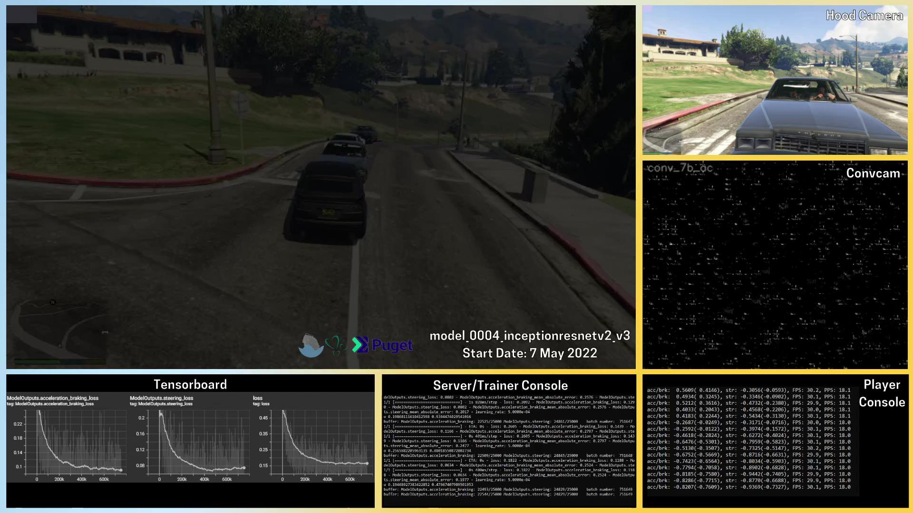
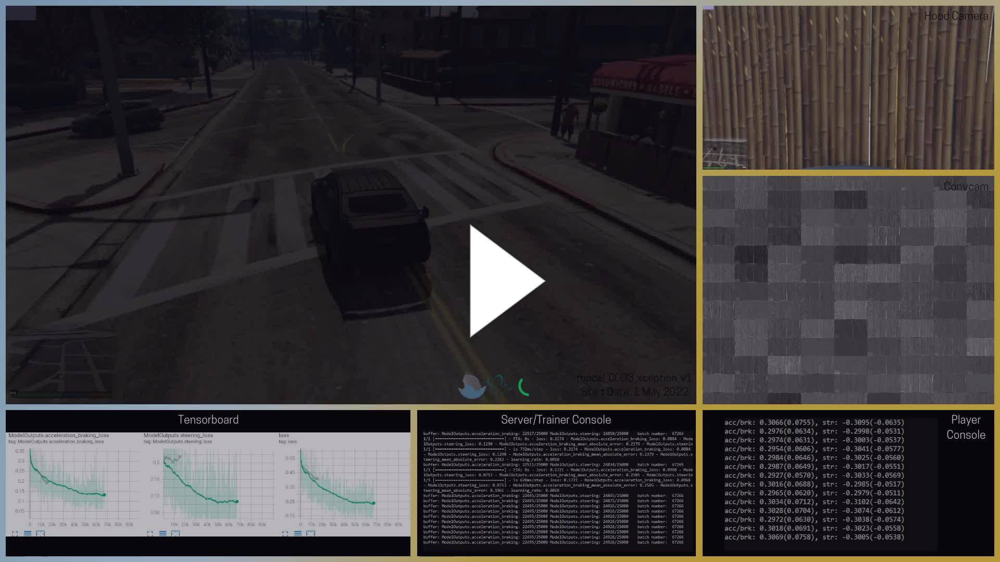

# Python Plays Grand Theft Auto 5 - Reboot

This is a reboot of the project from 2017, but with a whole new approach. This time, instead of collecting data by hand and training a classification model, we opted to create a whole new system for the data collecting, training and playing, and to do all of that live. Our models are now using regression (with other output types being still possible), training data is collected automatically and we stream models during their training phase so anyone can join and watch the progress.

Our AI, besides having multiple alter-egos (models), is still called **Charles**, like in 2017.

For a full explanation, refer to the [`System`](project_info/system.md) page, but for a quick summary - we’re using a central server that all other parts connect to. The [`Data Collectors`](project_info/system.md) run in separate GTA5 instances and our NPCs are collecting and [`Balancing`](project_info/data_balancing.md) the data, which is sent through the [`Server`](project_info/system.md) to the [`Trainer`](project_info/system.md). The [`Trainer`](project_info/system.md) buffers these data, trains the model and updates the [`Player`](project_info/system.md). The [`Player`](project_info/system.md) is using the [`Dual-Camera`](project_info/cameras.md) system to play so we can watch the 3rd person camera (also called cinematic camera) while the model is fed the [`Hood Camera`](project_info/cameras.md).

For more information, refer to these other pages:
- this page - main page with the project progress
- [`System`](project_info/system.md) - describing how all parts are working together to train and inference the models
- [`Cameras`](project_info/cameras.md) - how we created multiple cameras
- [`Convcam`](project_info/convcam.md) - what the Convcam is and how we use it
- [`Data Balancing`](project_info/data_balancing.md) - how we are balancing regression data
- [`NPCs`](project_info/NPCs.md) - our custom NPCs playing in the GTA5 to collect data automatically
- [`Purpose`](project_info/purpose.md) - a way to let the model “know” where to drive
- [`Storage and Buffer`](project_info/storage_buffer.md) - how are we managing the training data and why random batches are important
- [`Unstuck`](project_info/unstuck.md) - how to make the car not be stuck anywhere
- [`Xception`](project_info/xception.md) - the first CNN backbone architecture used
- [`InceptionResNetv2`](project_info/inceptionresnetv2.md) - the second, more successful, CNN backbone architecture used
- [`Tensorboard logs`](tensorboard_logs) - all of our Tensorboard logs for all of the trained models
- [The Original Project From 2017](original_project)
- [`model_0001_xception`](model_0001_xception) - the first logged [`Xception`](project_info/xception.md) model, [`Balancing_v1`](project_info/data_balancing.md)
- [`model_0002_xception`](model_0002_xception) - trying [`Balancing_v2`](project_info/data_balancing.md) and a custom model
- [`model_0003_xception`](model_0003_xception) - [`Balancing_v3`](project_info/data_balancing.md) and back to a standard model
- [`model_0004_inceptionresnetv2`](model_0004_inceptionresnetv2) - trying a bigger model - [`InceptionResNetv2`](project_info/inceptionresnetv2.md)
- [`model_0005_inceptionresnetv2`](model_0005_inceptionresnetv2) - transfer-learning attempt
- [`model_0006_inceptionresnetv2`](model_0006_inceptionresnetv2) - added stacked images
- [`model_0007_inceptionresnetv2`](model_0007_inceptionresnetv2) - trying a history inputs
- [`model_0008_irv2_data_td`](model_0008_irv2_data_td) - history with recurrent layers
- [`model_0009_irv2_cr_tl`](model_0009_irv2_cr_tl) - history with recurrent layers with transfer-learning
- [`model_0010_irv2_tcb`](model_0010_irv2_tcb) - dual-backbone [`InceptionResNetv2`](project_info/inceptionresnetv2.md)
- [`model_0011_x_tcb`](model_0011_x_tcb) - dual-backbone [`Xception`](project_info/xception.md)
- [`model_0012_regnet`](model_0012_regnet) - TBA

 
 

# Stream and current stream layout:
The progress is being streamed on Twitch: [https://www.twitch.tv/sentdex](https://www.twitch.tv/sentdex). Below we keep a list of dates and streamed models.

Stream's layout consists of:
  
- top-left tile is the 3rd person camera of the car driving, the main camera to observe Charles
- this main tile, in its lower-right corner, shows the current model and when it's been created
- top-right tile called [`Hood Camera`](project_info/cameras.md) is exactly what the models "see" - the input to the convolutional backbone of the model
- middle-right tile called [`Convcam`](project_info/convcam.md) shows the reshaped output of the CNN backbone and lets us observe how the CNN part trains
- bottom-right tile called [`Player Console`](project_info/system.md) shows current driving predictions along with additional information
- bottom-middle tile called [`Server/Trainer Console`](project_info/system.md) shows training progress along with some basic training information
- bottom-left tile called [`Tensorboard`](tensorboard_logs) shows the loss of the training process

 
 

# Driving examples:
&nbsp;

 
 

# Model list:

- [The Original Project From 2017](original_project) - how this started
- [`model_0001_xception`](model_0001_xception) - the first logged [`Xception`](project_info/xception.md) model, [`Balancing_v1`](project_info/data_balancing.md)
- [`model_0002_xception`](model_0002_xception) - trying [`Balancing_v2`](project_info/data_balancing.md) and a custom model
- [`model_0003_xception`](model_0003_xception) - [`Balancing_v3`](project_info/data_balancing.md) and back to a standard model
- [`model_0004_inceptionresnetv2`](model_0004_inceptionresnetv2) - trying a bigger model - [`InceptionResNetv2`](project_info/inceptionresnetv2.md)
- [`model_0005_inceptionresnetv2`](model_0005_inceptionresnetv2) - transfer-learning attempt
- [`model_0006_inceptionresnetv2`](model_0006_inceptionresnetv2) - added stacked images
- [`model_0007_inceptionresnetv2`](model_0007_inceptionresnetv2) - trying a history inputs
- [`model_0008_irv2_data_td`](model_0008_irv2_data_td) - history with recurrent layers
- [`model_0009_irv2_cr_tl`](model_0009_irv2_cr_tl) - history with recurrent layers with transfer-learning
- [`model_0010_irv2_tcb`](model_0010_irv2_tcb) - dual-backbone [`InceptionResNetv2`](project_info/inceptionresnetv2.md)
- [`model_0011_x_tcb`](model_0011_x_tcb) - dual-backbone [`Xception`](project_info/xception.md)
- [`model_0012_regnet`](model_0012_regnet) - TBA

 
 

# Streaming timeline

**May 1st:**
- Started streaming [`model_0003_xception_v2`](model_0003_xception) from scratch

**May 2nd:**
- Stopped streaming [`model_0003_xception_v2`](model_0003_xception) at batch *15250*
- Started streaming [`model_0003_xception_v1`](model_0003_xception) from batch *24500* (pre-trained off-stream)

**May 7th:**
- Stopped streaming [`model_0003_xception_v1`](model_0003_xception) at batch *162650*
- Started streaming [`model_0004_inceptionresnetv2_v1`](model_0004_inceptionresnetv2) from scratch
- Stopped streaming [`model_0004_inceptionresnetv2_v1`](model_0004_inceptionresnetv2) at batch *1250*
- Started streaming [`model_0004_inceptionresnetv2_v2`](model_0004_inceptionresnetv2) from scratch
- Stopped streaming [`model_0004_inceptionresnetv2_v2`](model_0004_inceptionresnetv2) after *~160* batches
- Started streaming [`model_0003_xception_v1`](model_0003_xception) from batch *162650* (continuing training)
- Stopped streaming [`model_0003_xception_v1`](model_0003_xception) at batch *165250*
- Started streaming [`model_0004_inceptionresnetv2_v1`](model_0004_inceptionresnetv2) from batch *1250* (continuing training)

**May 8th:**
- Stopped streaming [`model_0004_inceptionresnetv2_v1`](model_0004_inceptionresnetv2) at batch *12000*
- Started streaming [`model_0005_inceptionresnetv2_v1`](model_0005_inceptionresnetv2) from scratch
- Stopped streaming [`model_0005_inceptionresnetv2_v1`](model_0005_inceptionresnetv2) at batch *3500*
- Started streaming [`model_0004_inceptionresnetv2_v3`](model_0004_inceptionresnetv2) from batch *22250* (pre-trained off-stream)

**May 14th:**
- Stopped streaming [`model_0004_inceptionresnetv2_v3`](model_0004_inceptionresnetv2) at batch *184250*
- Started streaming [`model_0006_inceptionresnetv2_v1`](model_0006_inceptionresnetv2) from batch *18750* (pre-trained off-stream)

**May 16th:**
- Stopped streaming [`model_0006_inceptionresnetv2_v1`](model_0006_inceptionresnetv2) at batch *60500*
- The stream has been offline for several days since we had to send back the Comino machine and setting up another one took longer than we expected

**May 28th:**
- After new machine was set and new models developed, we restarted streaming
- Started streaming [`model_0009_irv2_cr_tl_v1`](model_0009_irv2_cr_tl) from scratch

**May 29th:**
- Stopped streaming [`model_0009_irv2_cr_tl_v1`](model_0009_irv2_cr_tl) at batch *19250*
- Started streaming [`model_0004_inceptionresnetv2_v3`](model_0004_inceptionresnetv2) from batch *184250* (continuing training)

**July 5th:**
- Stopped streaming [`model_0004_inceptionresnetv2_v3`](model_0004_inceptionresnetv2) at batch *752000*
- The stream has been stopped as there have been no further improvements in the model and to catch up with documentation and do some off-stream development

 
 

# Project timeline

This is not a full project log and contains only the key changes that are visible on the stream (and a few from before the stream has started). There are many more things going on "behind the scenes".

**2017:**
- Development of [The Original Project From 2017](original_project)

**November 2021:**
- The idea of bringing back this project has born

**Early 2022:**
- The project has started the development phase of the main system, the initial models, and the game mod

**April 8th:**
- Finished [`Balancing_v1`](project_info/data_balancing.md)
- Started training [`model_0001_xception_v1`](model_0001_xception) from scratch
- Stopped training [`model_0001_xception_v1`](model_0001_xception) at batch *10800*
- Started training [`model_0001_xception_v2`](model_0001_xception) from scratch

**April 9th:**
- Stopped training [`model_0001_xception_v2`](model_0001_xception) at batch *7150*
- Started training [`model_0001_xception_v3`](model_0001_xception) from scratch
- Started training [`model_0001_xception_v4`](model_0001_xception) from scratch
- Stopped training [`model_0001_xception_v3`](model_0001_xception) at batch *18850*
- Started training [`model_0001_xception_v5`](model_0001_xception) from scratch

**April 10th:**
- Stopped training [`model_0001_xception_v5`](model_0001_xception) at batch *25200*
- Stopped training [`model_0001_xception_v3`](model_0001_xception) at batch *23300*
- Started training [`model_0001_xception_v6`](model_0001_xception) from scratch

**April 11th:**
- The first data histogram has been created to see the [`Data Balancing`](project_info/data_balancing.md)

**April 15th:**
- Stopped training [`model_0001_xception_v6`](model_0001_xception) at batch *176850*

**April 19th:**
- Started training [`model_0002_xception_v1`](model_0002_xception) from scratch

**April 22nd:**
- Started training [`model_0003_xception_v1`](model_0003_xception) from scratch

**April 24th:**
- Stopped training [`model_0003_xception_v1`](model_0003_xception) at batch *24500*

**April 30th:**
- Stopped training [`model_0002_xception_v1`](model_0002_xception) at batch *249750*

**May 1st:**
- The Convcam has been created
- Started streaming on Twitch.tv
- Started streaming [`model_0003_xception_v2`](model_0003_xception) from scratch

**May 2nd:**
- Stopped streaming [`model_0003_xception_v2`](model_0003_xception) at batch *15280*
- Started streaming [`model_0003_xception_v1`](model_0003_xception) from batch *24500* (pre-trained off-stream)
- Started training [`model_0003_xception_v3`](model_0003_xception) from scratch

**May 3rd:**
- Stopped training [`model_0003_xception_v3`](model_0003_xception) at batch *17500*
- Started training [`model_0003_xception_v4`](model_0003_xception) from scratch
- Stopped training [`model_0003_xception_v4`](model_0003_xception) at batch *5150*

**May 7th:**
- Stopped streaming [`model_0003_xception_v1`](model_0003_xception) at batch *162650*
- Started streaming [`model_0004_inceptionresnetv2_v1`](model_0004_inceptionresnetv2) from scratch
- Stopped streaming [`model_0004_inceptionresnetv2_v1`](model_0004_inceptionresnetv2) at batch *1250*
- Started streaming [`model_0004_inceptionresnetv2_v2`](model_0004_inceptionresnetv2) from scratch
- Stopped streaming [`model_0004_inceptionresnetv2_v2`](model_0004_inceptionresnetv2) after *~160* batches
- Started streaming [`model_0003_xception_v1`](model_0003_xception) from batch *162650* (continuing training)
- Stopped streaming [`model_0003_xception_v1`](model_0003_xception) at batch *165350*
- Started training [`model_0004_inceptionresnetv2_v3`](model_0004_inceptionresnetv2) from scratch
- Started streaming [`model_0004_inceptionresnetv2_v1`](model_0004_inceptionresnetv2) from batch *1250* (continuing training)

**May 8th:**
- Stopped streaming [`model_0004_inceptionresnetv2_v1`](model_0004_inceptionresnetv2) at batch *12000*
- Started streaming [`model_0005_inceptionresnetv2_v1`](model_0005_inceptionresnetv2) from scratch
- Stopped streaming [`model_0005_inceptionresnetv2_v1`](model_0005_inceptionresnetv2) at batch *3500*
- Stopped training [`model_0004_inceptionresnetv2_v3`](model_0004_inceptionresnetv2) at batch *22250*
- Started streaming [`model_0004_inceptionresnetv2_v3`](model_0004_inceptionresnetv2) from batch *22250* (pre-trained off-stream)

**May 13th:**
- Started training [`model_0006_inceptionresnetv2_v1`](model_0006_inceptionresnetv2) from scratch

**May 14th:**
- Stopped training [`model_0006_inceptionresnetv2_v1`](model_0006_inceptionresnetv2) at batch *18750*
- Stopped streaming [`model_0004_inceptionresnetv2_v3`](model_0004_inceptionresnetv2) at batch *184250*
- Started streaming [`model_0006_inceptionresnetv2_v1`](model_0006_inceptionresnetv2) from batch *18750* (pre-trained off-stream)

**May 14th:**
- Started training [`model_0006_inceptionresnetv2_v2`](model_0006_inceptionresnetv2) from scratch
- Stopped training [`model_0006_inceptionresnetv2_v2`](model_0006_inceptionresnetv2) at batch *5750*

**May 16th:**
- Stopped streaming [`model_0006_inceptionresnetv2_v1`](model_0006_inceptionresnetv2) at batch *60500*
- Stream has been offline for several days since we had to send back the Comino machine and setting up another one took longer than we expected

**May 22nd:**
- Started training [`model_0007_inceptionresnetv2_v2`](model_0007_inceptionresnetv2) from scratch
- Stopped training [`model_0007_inceptionresnetv2_v2`](model_0007_inceptionresnetv2) at batch *10500*

**May 23th:**
- Started training [`model_0008_inceptionresnetv2_v1`](../model_0008_inceptionresnetv2) from scratch

**May 24th:**
- Stopped training [`model_0008_inceptionresnetv2_v1`](../model_0008_inceptionresnetv2) at batch *35000*
- Started training [`model_0008_inceptionresnetv2_v2`](../model_0008_inceptionresnetv2) from scratch
- Started training [`model_0008_inceptionresnetv2_v3`](../model_0008_inceptionresnetv2) from scratch

**May 25th:**
- Stopped training [`model_0008_inceptionresnetv2_v2`](../model_0008_inceptionresnetv2) at batch *19000*
- Stopped training [`model_0008_inceptionresnetv2_v3`](../model_0008_inceptionresnetv2) at batch *17000*
- Started training [`model_0008_inceptionresnetv2_v4`](../model_0008_inceptionresnetv2) from scratch
- Started training [`model_0008_inceptionresnetv2_v5`](../model_0008_inceptionresnetv2) from scratch

**May 26th:**
- Stopped training [`model_0008_inceptionresnetv2_v5`](../model_0008_inceptionresnetv2) at batch *37250*

**May 28th:**
- Stopped training [`model_0008_inceptionresnetv2_v4`](../model_0008_inceptionresnetv2) at batch *35500*
- After new machine was set and new models developed, we restarted streaming
- Started streaming [`model_0009_irv2_cr_tl_v1`](model_0009_irv2_cr_tl) from scratch
- Started training [`model_0009_irv2_cr_tl_v2`](model_0009_irv2_cr_tl) from scratch

**May 29th:**
- Stopped streaming [`model_0009_irv2_cr_tl_v1`](model_0009_irv2_cr_tl) at batch *19250*
- Started streaming [`model_0004_inceptionresnetv2_v3`](model_0004_inceptionresnetv2) from batch *184250* (continuing training)

**May 30th:**
- Stopped training [`model_0009_irv2_cr_tl_v2`](model_0009_irv2_cr_tl) at batch *20000*
- Started training [`model_0009_irv2_cr_tl_v3`](model_0009_irv2_cr_tl) from scratch

**May 31th:**
- Stopped training [`model_0009_irv2_cr_tl_v3`](model_0009_irv2_cr_tl) at batch *15000*
- Started training [`model_0009_irv2_cr_tl_v4`](model_0009_irv2_cr_tl) from scratch

**June 1th:**
- Stopped training [`model_0009_irv2_cr_tl_v4`](model_0009_irv2_cr_tl) at batch *50000*

**June 3rd:**
- Started training [`model_0009_irv2_cr_tl_v5`](model_0009_irv2_cr_tl) from scratch
- Created model line [`model_0010_irv2_tcb`](model_0010_irv2_tcb), none of the models were trained as of yet
- Created model line [`model_0011_x_tcb`](model_0011_x_tcb), none of the models were trained as of yet

**June 4th:**
- Stopped training [`model_0009_irv2_cr_tl_v5`](model_0009_irv2_cr_tl) at batch *52500*

**June 9th:**
- Started training [`model_0008_inceptionresnetv2_v6`](../model_0008_inceptionresnetv2) from scratch

**June 10th:**
- Stopped training [`model_0008_inceptionresnetv2_v6`](../model_0008_inceptionresnetv2) at batch *45250*
- Started training [`model_0008_inceptionresnetv2_v7`](../model_0008_inceptionresnetv2) from scratch

**June 13th:**
- Stopped training [`model_0008_inceptionresnetv2_v7`](../model_0008_inceptionresnetv2) at batch *75000*

**July 5th:**
- Stopped streaming [`model_0004_inceptionresnetv2_v3`](model_0004_inceptionresnetv2) at batch *752000*
- The stream has been stopped as there have been no further improvements in the model and to catch up with documentation and do some off-stream development
