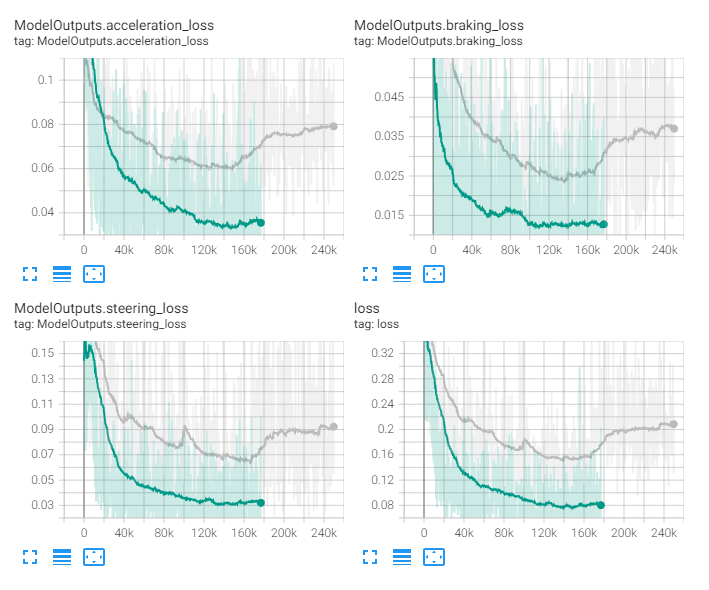
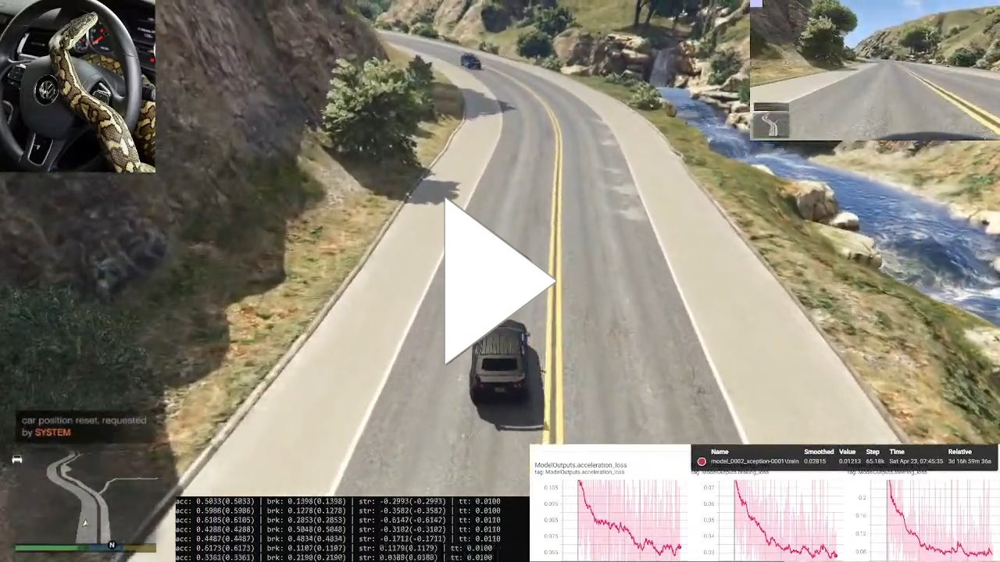
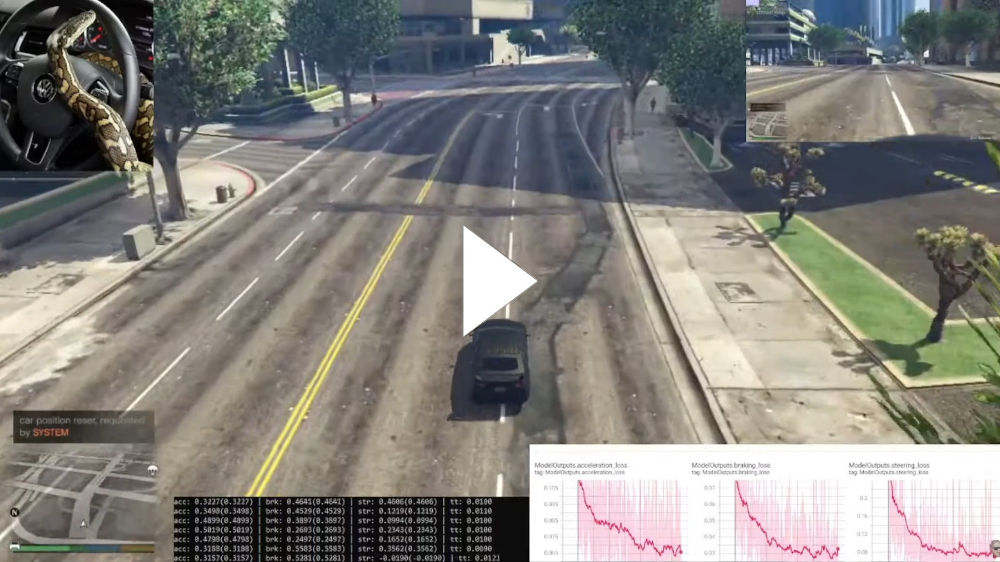
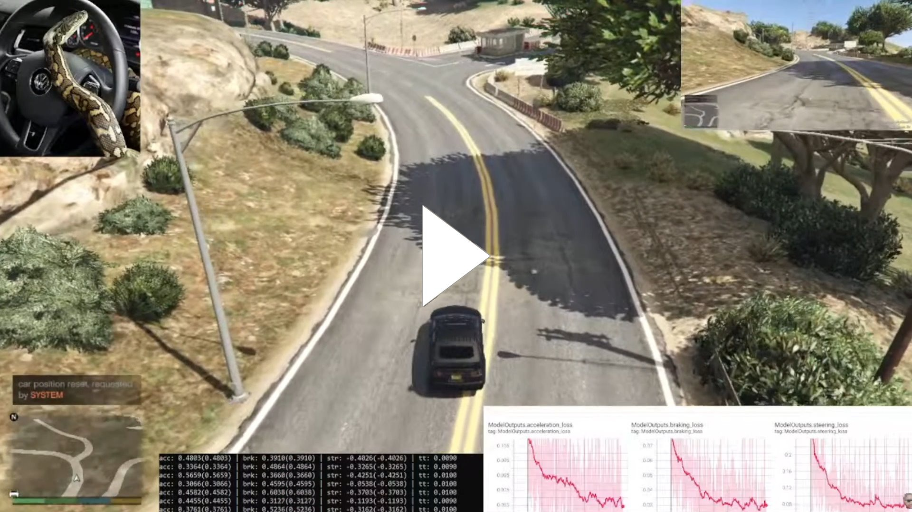
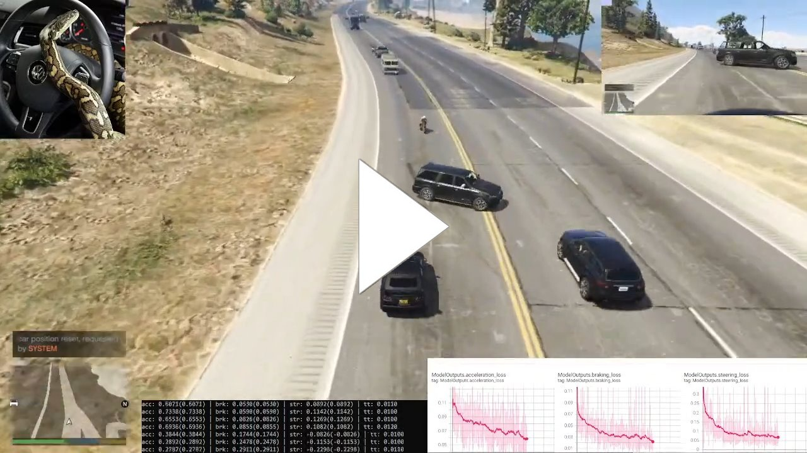

<< [Back](../../../)

# model_0002_xception

This model line represents what we call a custom model (as opposed to a Keras model created using the so-called functional API). It consists of the main model but additionally also 3 helper models. These helper models are built using a common model part but only a single attached output at a time - for each of the outputs. We can then use these helper models to train the common part and only the given output. Data balancing [`Balancing_v2`](../project_info/data_balancing.md) has changed the approach to data balancing and now each output has been balanced separately, which means the training data samples contain only this single output and each of the outputs have to be trained separately. Our custom training loop is performing the forward passes through each of the helper models (one per output) using samples containing this output's data. Next, the gradients are calculated using these helper models and summed to create gradients for the main model to be updated with. The inference is being performed using the main model in a standard Keras’ way since we're predicting all outputs at once. Because each output is being trained separately, this model consumes 3x more samples to train.

## List of the models:
- [`model_0002_xception_v1`](#model_0002_xception_v1)

 
 

## model_0002_xception_v1

Training periods: `April 19th-30th` (batches: *0-249750*, off-stream)  
Training batches (total): *249750*

*Model summary:*  
- Total params: `23,799,371`
- Trainable params: `23,744,843`
- Non-trainable params: `54,528`

*Main model architecture:*  

*Tensorboard logs:*  

This model is identical to the [`model_0001_xception_v6`](../model_0001_xception) model - it consists of the [`Xception`](../project_info/xception.md) model as the CNN backbone, a single densely connected layer in a common part, 3 densely-connected layers with the number of neurons in each of the consecutive layers being divided by 4 for the heads and the regression output layers for each of the heads (outputs).

As mentioned in the model overview of the model line on top of this page, there are additional 3 models which contain the common CNN part but only a single, given head. This was necessary because [`Balancing_v2`](../project_info/data_balancing.md) has been created to perform balancing on each of the outputs separately (read more about it on the [`Balancing`](../project_info/data_balancing.md) page). To perform a single training step, we have to perform separate forward passes through each of these models using samples dedicated to them (containing output data for this given output), then perform additional calculations to form a gradient which can then be optimized onto the main model. This also turned out to be a significantly slower way of training the model.

This model is the first one that started to steer, accelerate, and brake more correctly. It is not super decent steering, though, and the reason for this might be the fact we are training the outputs separately, so samples for each of the outputs consist of different images. This could mean that the model does not learn the correlation between the outputs correctly. With all of this, we decided to update the data balancing to [`Balancing_v3`](../project_info/data_balancing.md) which brings back output correlation with a trade-off of slight data un-balancing (read more about it on the [`Balancing`](../project_info/data_balancing.md) page).

The below Tensorboard screenshot shows the current model's loss (gray line) compared to the [`model_0001_xception_v6`](../model_0001_xception) model's loss (green line) - higher loss is an effect of better data balancing (the model does not overfit to some most common values). An additional observation is how, even with the higher loss, this model works much better than the previous one:

The below videos show how this model has been driving at various training progress. Keep in mind this was still before we started streaming and many things were not yet finished, for example, there's no streaming layout and a lot of stuttering can be seen (click to watch the video):  
**April 23rd**, steps: *65180*:  
  
**April 23rd**, steps: *~67000*:  
  
**April 23rd**, steps: *~67000*:  
  
**April 23rd**, steps: *~73000*:  
  
**April 25th**, steps: *~12600*:  
  

