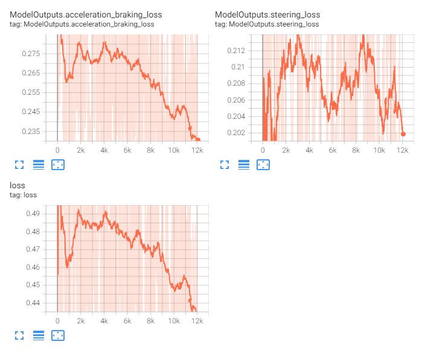
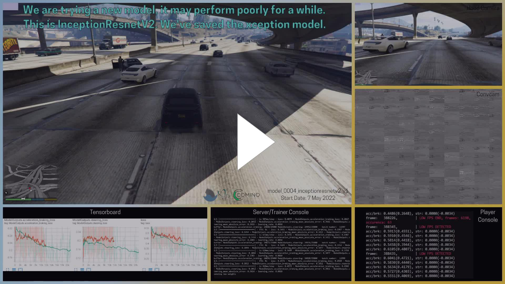
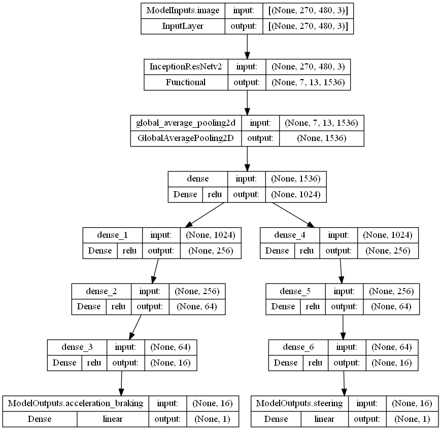
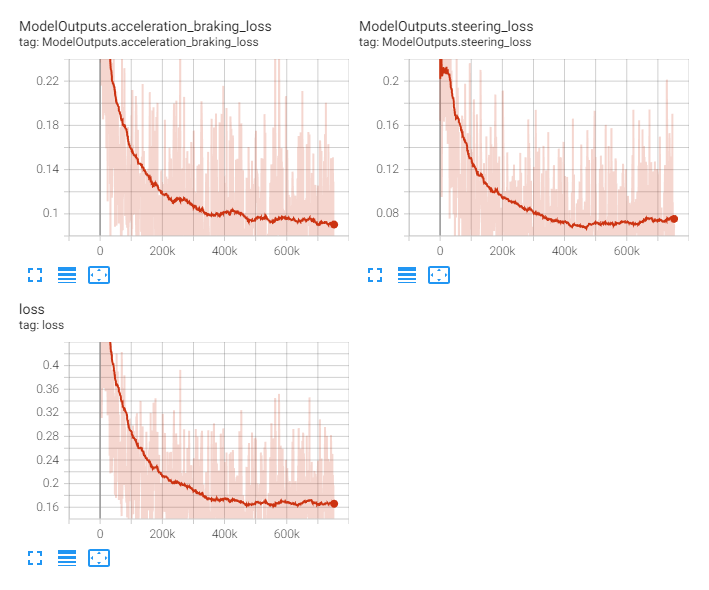
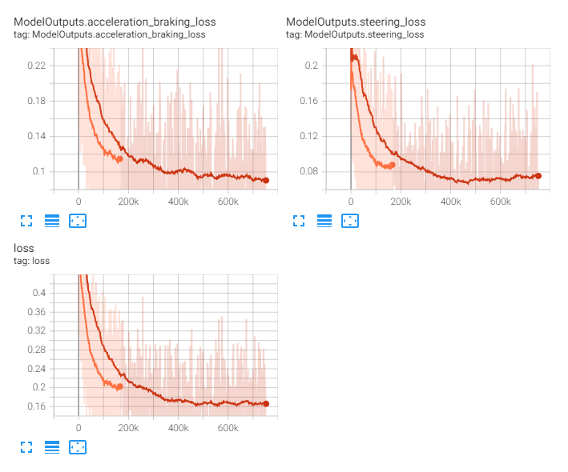
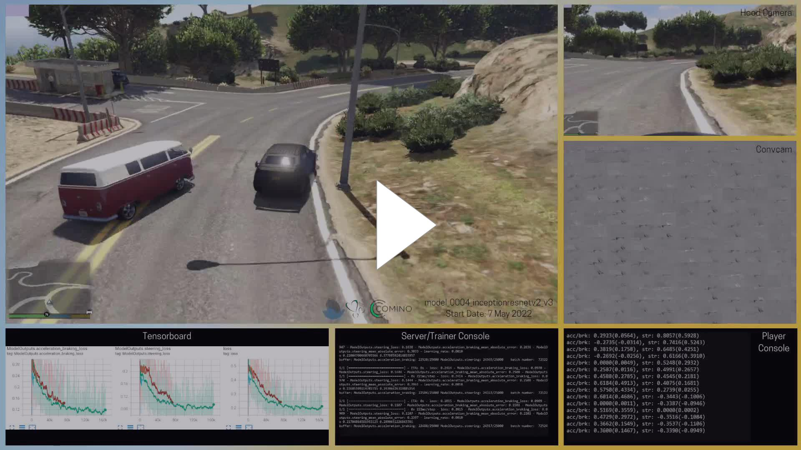
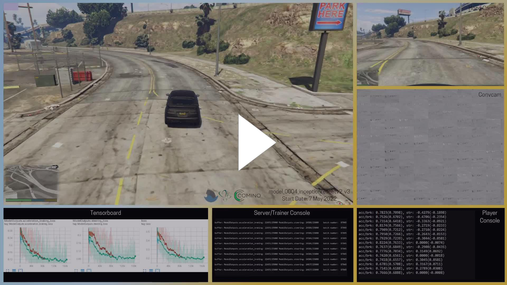
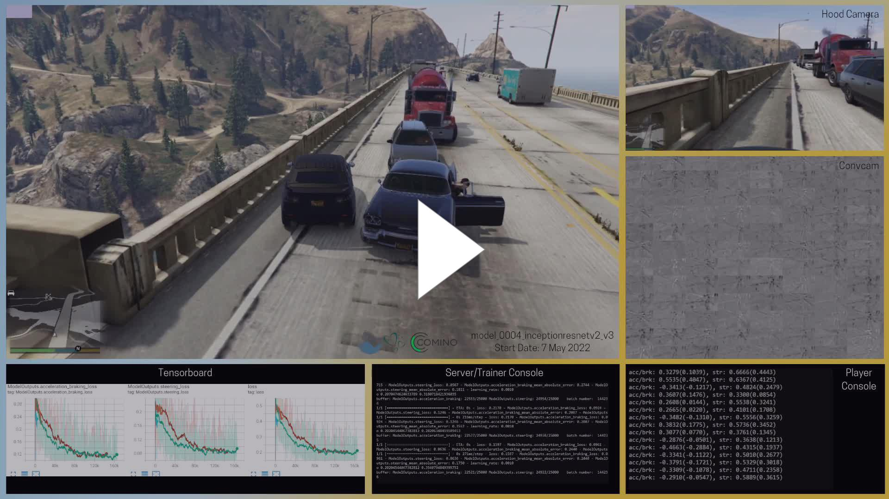
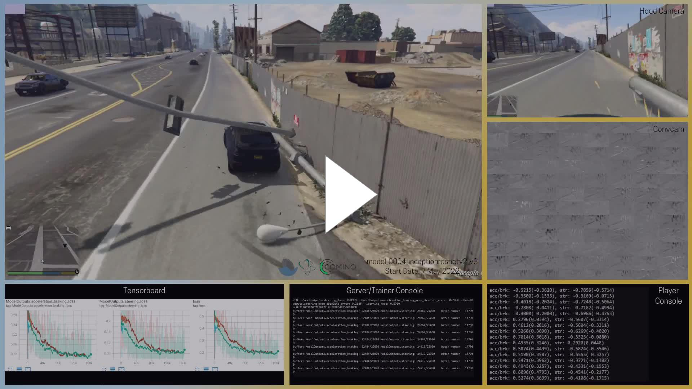
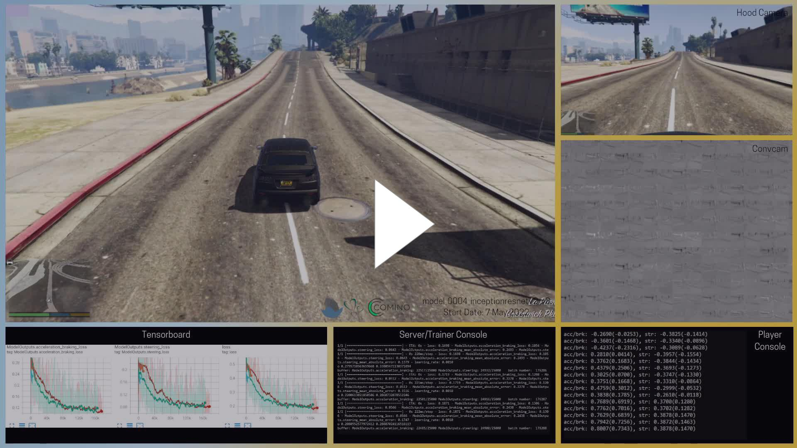

<< [Back](../../../)

# model_0004_inceptionresnetv2

This model line has the same structure as the [`model_0003_xception`](../model_0003_xception) with a difference in the backbone CNN model - [`InceptionResNetv2`](../project_info/inceptionresnetv2.md) instead of the [`Xception`](../project_info/xception.md). [`InceptionResNetv2`](../project_info/inceptionresnetv2.md) is only a slightly "slower" model, but has roughly twice as many trainable parameters and is significantly deeper (has more layers, so can also learn more complex and more multi-dimensional dependencies).

## List of the models:
- [`model_0004_inceptionresnetv2_v1`](#model_0004_inceptionresnetv2_v1)
- [`model_0004_inceptionresnetv2_v2`](#model_0004_inceptionresnetv2_v3)
- [`model_0004_inceptionresnetv2_v3`](#model_0004_inceptionresnetv2_v4)

 
 

## model_0004_inceptionresnetv2_v1

Training periods: `May 7th` (batches: *0-1250*, streamed), `May 7th-8th` (batches: *1250-12000*, streamied)  
Training batches (total): *12000*

*Model summary:*  
- Total params: `56,470,434`
- Trainable params: `56,409,890`
- Non-trainable params: `60,544`

*Model architecture:*  

*Tensorboard logs:*  

This model consists of the [`InceptionResNetv2`](../project_info/inceptionresnetv2.md) model as the CNN backbone, a single densely connected layer and 2 heads containing 3 densely-connected layers with the number of neurons in each of the consecutive layers being divided by 4 for the heads and the regression output layers for each of the heads (outputs). It is almost identical to the [`model_0003_xception`](../model_0003_xception) line with the only difference now we’re using [`InceptionResNetv2`](../project_info/inceptionresnetv2.md) instead of [`Xception`](../project_info/xception.md) as the CNN backbone.

We wanted to test something with a bigger capacity to see if we can achieve better results and [`InceptionResNetv2`](../project_info/inceptionresnetv2.md) turned out to be only a bit slower in inference than [`Xception`](../project_info/xception.md), but offers twice as many parameters and is much deeper (has more layers) which means bigger model capacity and ability to learn more complex (more multi-dimensional) dependencies - should let Charles drive better.

We started training this model from scratch on stream and stopped after *1250* batches as the loss did not look right (or as we thought it did not) to restart training with [`model_0004_inceptionresnetv2_v2`](#model_0004_inceptionresnetv2_v2) (same model, from scratch) and see if the loss is going to be different - this model’s loss did not look like anything we knew and we thought that maybe it was because of the initial parameter values (later turned out we just should be more patient and the model will eventually converge). We also switched to the [`model_0003_xception_v1`](../model_0003_xception) model shortly to think about the next steps and got back to train this model overnight. As not much progress has been seen (it did not steer at all, steering predictions were stuck with the same values changing only when the model updates) we stopped training it to try the [`model_0005_inceptionresnetv2_v1`](../model_0005_inceptionresnetv2) model, which is the transfer learning model, in the hope pre-trained weights will make it work. We later figured out patience is a key and we should let it train for longer to start converging.

*An example of the steering right before we stopped training this model:*  
  

 
 

## model_0004_inceptionresnetv2_v2

Training periods: `May 7th` (batches: *0-~160*, streamed)  
Training batches (total): *~160*

*Model summary:*  
- Total params: `56,470,434`
- Trainable params: `56,409,890`
- Non-trainable params: `60,544`

*Model architecture:*  

*Tensorboard logs:*  

This model is identical to the [`model_0004_inceptionresnetv2_v1`](#model_0004_inceptionresnetv2_v1) model.

It has been streamed and was a test to see if parameter initialization with different (random) values can make a difference. It did not. The model has been stopped quickly, after about 160 batches of training.

 
 

## model_0004_inceptionresnetv2_v3

Training periods: `May 7th-8th` (batches: *0-22250*, off-stream), `May 8th-14th` (batches: *22250-184250*, streamed), `May 29th - July 5th` (batches: *184250-752000*, streamed)  
Training batches (total): *752000*

*Model summary:*  
- Total params: `56,470,434`
- Trainable params: `56,409,890`
- Non-trainable params: `60,544`

*Model architecture:*  

*Tensorboard logs:*  

This model is identical to the [`model_0004_inceptionresnetv2_v1`](#model_0004_inceptionresnetv2_v1) and [`model_0004_inceptionresnetv2_v2`](#model_0004_inceptionresnetv2_v2) models. It is trained with the learning rate warmup (rising learning rate during the first 1000 batches) to see if this helps with loss. It did not make a difference.

This model has started training off-stream, to see if it can actually start converging and it did after about 22,000 steps. This was the moment when we realized we should let many of our previous models train for longer, but back then we did not know they need this much time - much more time than we thought. At the time this model has been training, we've been streaming model [`model_0004_inceptionresnetv2_v1`](#model_0004_inceptionresnetv2_v1) then tried [`model_0005_inceptionresnetv2_v1`](#model_0005_inceptionresnetv2_v1) (transfer learning) but switched to stream this model once it started converging.

We later stopped training this model at step *184250* to try [`model_0006_inceptionresnetv2_v1`](../model_0006_inceptionresnetv2) (stacked images) and then to send the Comino machine back (this is also when we've been assembling a new machine and solving lots of issues related to that). We’ve been also trying to prepare a new model. In general it took a few days before stream went back up.

This model also started surprising us how decent it can be. For example, it can stick to a given action even if it works off a single frame and does not "remember" previous actions. It also could, for example, take a turn on the intersection or back up and drive past the obstackle.

Compared to the [`model_0003_xception_v1`](../model_0003_xception), the loss of this model went lower and the model learned significantly more:

it learned more

*Examples of the model driving:*  
**May 10th**, batch: *72520*:  
  
**May 11th**, batch: *87040*:  
  
**May 13th**, batch: *144230*:  
  
**May 13th**, batch: *147910*:  
  
**May 1th**, batch: *176280*:  
  

The model has been further trained on stream starting on May 29th and ending on July 5th when it has been stopped as there have been no further improvements in the model and to catch up with the documentation and do some off-stream development. We've been training this model (with breaks) from May 7th up until July 5th.
