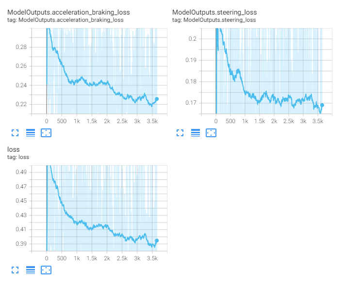
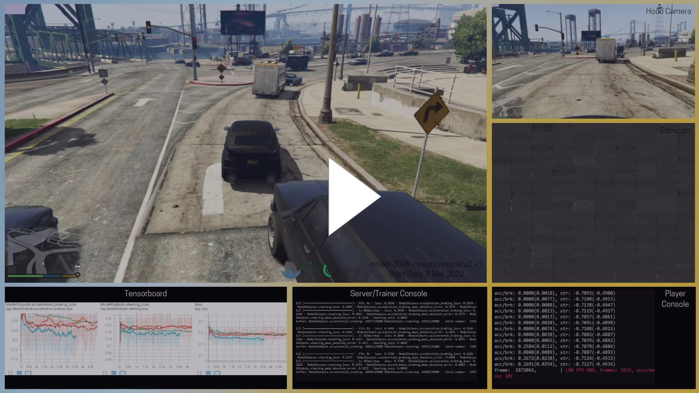

<< [Back](../../../)

# model_0005_inceptionresnetv2

The architecture of this model line is identical to the [`model_0004_inceptionresnetv2`](../model_0004_inceptionresnetv2). The difference is this model has been prepared to be able to use transfer-learning using the `Imagenet` weights.

## List of the models:
- [`model_0005_inceptionresnetv2_v1`](#model_0005_inceptionresnetv2_v1)

 
 

## model_0005_inceptionresnetv2_v1

Training periods: `May 8th` (batches: *0-3500, streamed*)  
Training batches (total): *12000*

*Model summary:*  
- Total params: `56,470,434`
- Trainable params: `56,409,890`
- Non-trainable params: `60,544`

*Model architecture:*  

*Tensorboard logs:*  

This model's architecture is identical to the [`model_0004_inceptionresnetv2`](../model_0004_inceptionresnetv2) line. It consists of the [`InceptionResNetv2`](../project_info/inceptionresnetv2.md) model as the CNN backbone, a single densely connected layer and 2 heads containing 3 densely-connected layers each with the number of neurons in each of the consecutive layers being divided by 4, and the output layers for each of the regression outputs.

This model has been created to add transfer-learning capability. Because (at the time) the model trained from scratch did not converge (or we thought it did not, later we learned it eventually will) we wanted to try transfer-learning using the `Imagenet` weights in the CNN part ([`InceptionResNetv2`](../project_info/inceptionresnetv2.md) layers) with the other layers being trained from scratch. The CNN layers have not been frozen to let them re-train to our actual data. This indeed made the model not be stuck with steering and start converging much earlier, but after about *3500* batches of training our other model that has been training from scratch off-stream ([`model_0004_inceptionresnetv2_v3`](../model_0004_inceptionresnetv2)) started converging and we switched to scream this other model instead. If we have an infinite amount of data, it is always better for us to train a model from scratch using only our data instead of using pre-trained weights trained on unrelated data. We never went back to train this model more.

*Model example:*  
  
Since the model has been trained only for about 3500 batches, it did not learn anything useful yet.
