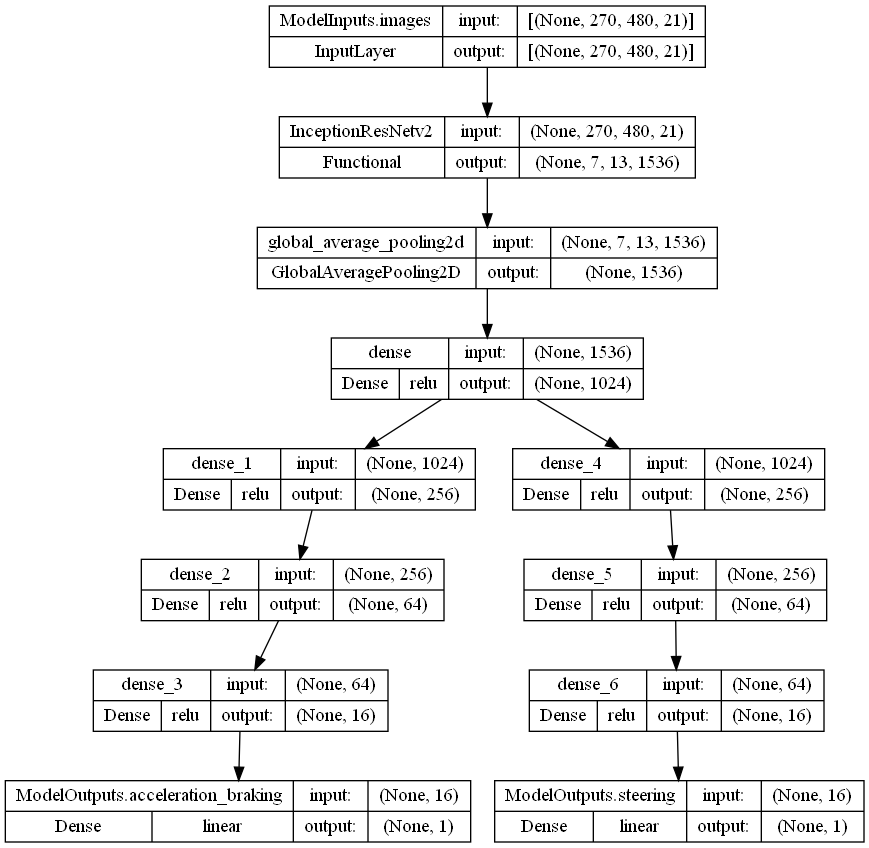
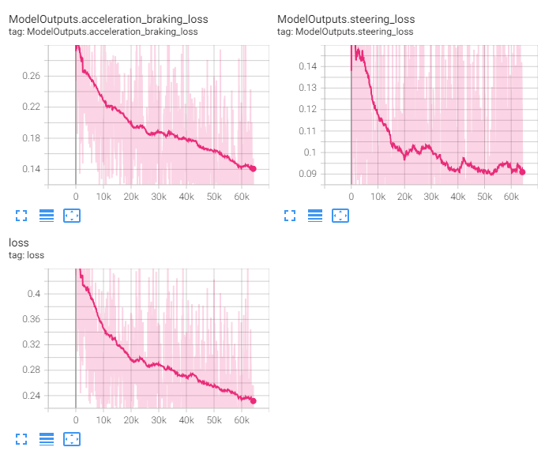
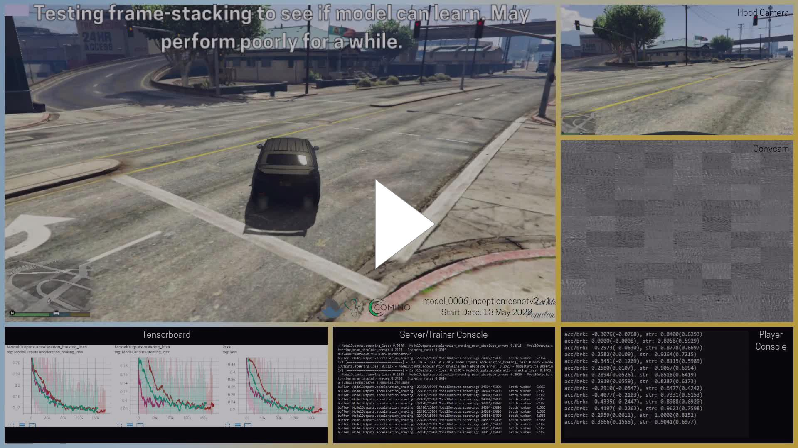
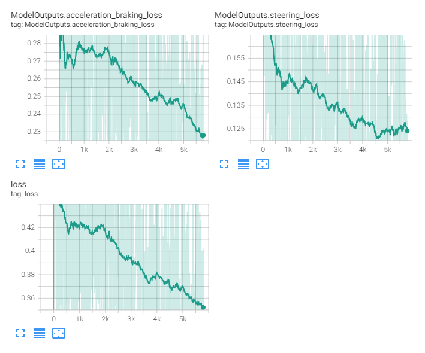

<< [Back](../../../)

# model_0006_inceptionresnetv2

The architecture of this model line is identical to the [`model_0004_inceptionresnetv2`](../model_0004_inceptionresnetv2) and [`model_0005_inceptionresnetv2`](../model_0005_inceptionresnetv2) lines. The difference is this model has been prepared to take a stack of up to 7 images (the current one + up to 6 past images) as the input to the CNN backbone.

## List of the models:
- [`model_0006_inceptionresnetv2_v1`](#model_0006_inceptionresnetv2_v1)
- [`model_0006_inceptionresnetv2_v2`](#model_0006_inceptionresnetv2_v2)

 
 

## model_0006_inceptionresnetv2_v1

Training periods: `May 13th-14th` (batches: *0-18750*, off-stream), `May 14th-16th` (batches: *18750-64000*, streamed)  
Training batches (total): *64000*

*Model summary:*  
- Total params: `56,475,618`
- Trainable params: `56,415,074`
- Non-trainable params: `60,544`

*Model architecture:*  

*Tensorboard logs:*  

This model's architecture is identical to the [`model_0004_inceptionresnetv2`](../model_0004_inceptionresnetv2) and the [`model_0005_inceptionresnetv2`](../model_0005_inceptionresnetv2) lines. It consists of the [`InceptionResNetv2`](../project_info/inceptionresnetv2.md) model as the CNN backbone, a single densely connected layer and 2 heads containing 3 densely-connected layers each with the number of neurons in each of the consecutive layers being divided by 4, and the output layers for each of the regression outputs.

This model has been created to check if the addition of historical images to the model can make it "remember" past actions and possibly stick to them temporarily (like taking a turn that takes multiple frames and the model should stick with this decision) and add the sense of speed so the car can properly accelerate or decelerate (for example to not slow down this much near to the intersection to stop completely - intersections are places where there is a high chance the car will take a turn and if it does, it must slow down). With this model, in addition to the current frame, we've been stacking 6 past frames making it a total of 7 frames. The stacking has been achieved by concatenating images in the last dimension. In simple words, if a single image has 3 channels (or "layers") - `R`, `G` and `B` (red, green, and blue), we can refer to them as `RGB`. Additional stacked images extended this with more channels as follows: `RGBRGBRGBRGBRGBRGBRGB` - by creating an "image" containing 21 channels (or "layers").

This model does not perform well, though. We called its behavior the "identity crisis", which is not far from why it is behaving this particular way. The observed behavior is similar to multiple people trying to grab and use the steering wheel to change the direction at the same time. The other observation is the car riding the snakeskin. We later realized this was a result of the model "not knowing" which frame is the most common and which are the past frames as well as what's the order of the frames. This caused the model to make the actions based on the random frames from these passed to the model. The model could not "know" the order of the frames as the frames are not time-distributed in any way and even the first convolutional layer is mixing them up with its kernels - the kernels are processing 21 channels without any context of what they are).

*This is an example from the late model stage (right before we stopped training and streaming it), showing mentioned behavior:*  
  

We did not stop the model immediately when we realized mentioned issue as we've been trying to prepare the Puget workstation while the Comino machine has been close to being sent back.

 
 

## model_0006_inceptionresnetv2_v2

Training periods: `May 15th` (batches: *0-5750*, off-stream)  
Training batches (total): *5750*

*Model summary:*  
- Total params: `56,472,162`
- Trainable params: `56,411,618`
- Non-trainable params: `60,544`

*Model architecture:*  

*Tensorboard logs:*  

This model's architecture is identical to the [`model_0006_inceptionresnetv2_v1`](#model_0006_inceptionresnetv2_v1) model. It has never been streamed but only trained off-stream.

Yet before we realized the flaw of this model line, we lowered the number of stacked frames from 7 to 3 to see if this makes any difference - for example, let the model figure out the data easier. The training did not differ much from the above model.

In the future, we might approach this way of feeding the model again, but by adding the temporal aspect to the model, for example by using the `ConvLSTM2D` layers which will time-distribute the input image frames.

This model has not been streamed.
