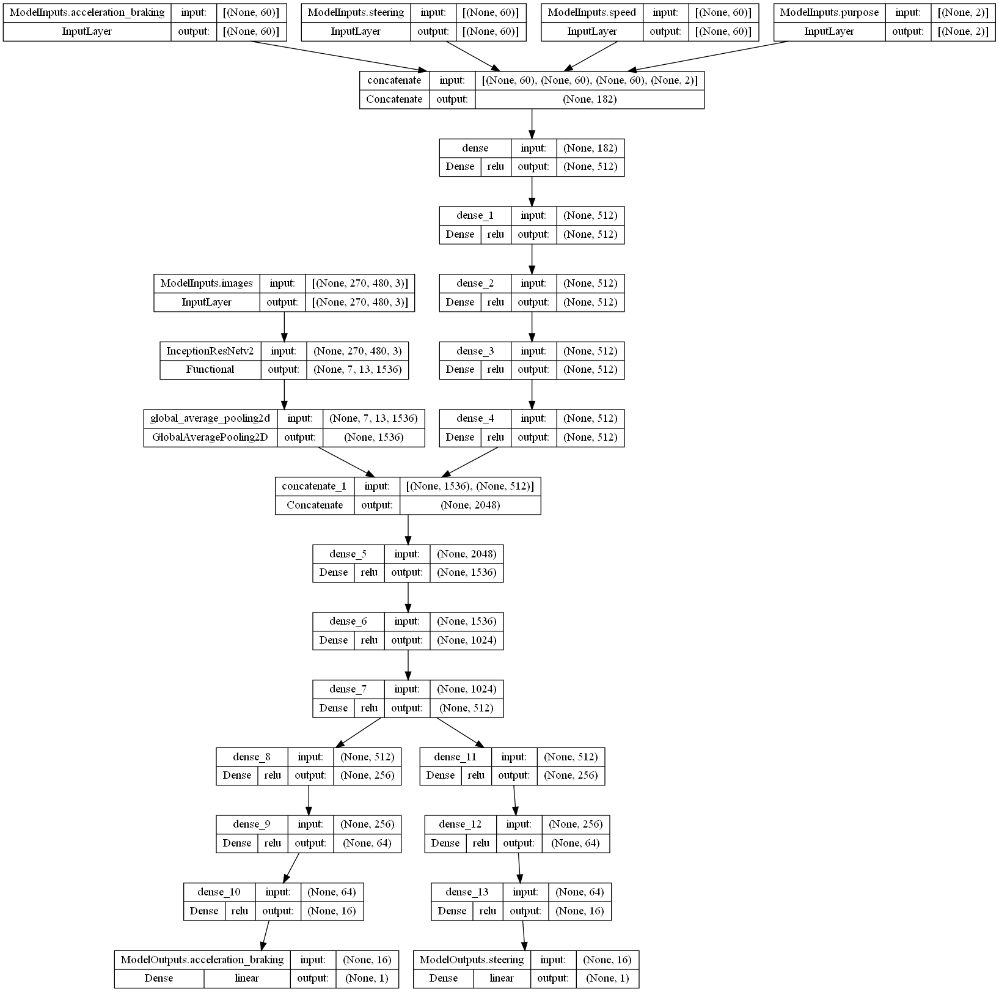
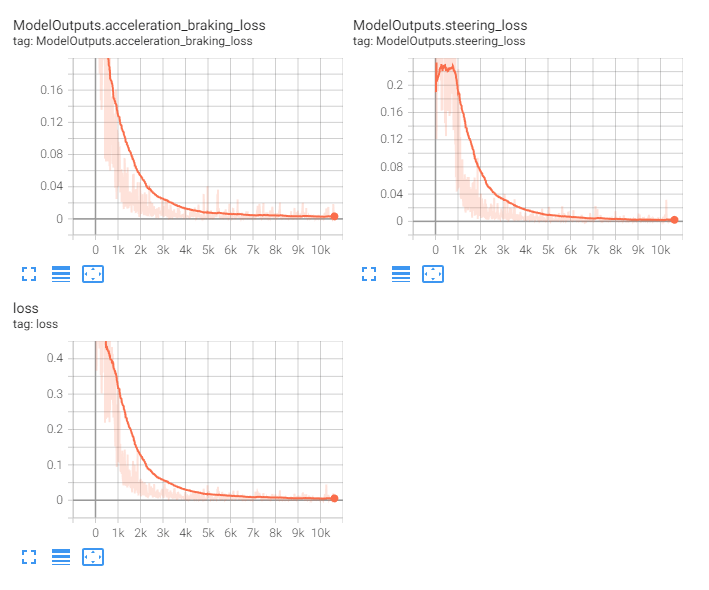

<< [Back](../../../)

# model_0007_inceptionresnetv2

This model line adds back the acceleration/braking, steering, and speed history (last 60 data points) known from the [`model_0001_xception`](../model_0001_xception) model line, accompanied by the [`purpose`](../project_info/purpose.md). The [`Purpose`](../project_info/purpose.md) is a vector of a relative distance and direction to a point on the map the car should approach. The main reason for the purpose is to... give the car some purpose in driving so it can, for example, better stick to taken actions like making turns on the intersections.

## List of the models:
- [`model_0007_inceptionresnetv2_v1`](#model_0007_inceptionresnetv2_v1)

 
 

## model_0007_inceptionresnetv2_v1

Training periods: `May 15th` (batches: *0-10500*, off-stream)  
Training batches (total): *10500*

*Model summary:*  
- Total params: `61,024,674`
- Trainable params: `60,964,130`
- Non-trainable params: `60,544`

*Model architecture:*  
  

*Tensorboard logs:*  

This model's architecture consists of the [`InceptionResNetv2`](../project_info/inceptionresnetv2.md) model as the CNN backbone and 4 additional inputs (acceleration/braking, steering, speed) that are being concatenated and fed through 5 fully-connected layers before being concatenated to the CNN backbone output. After concatenation, the common fully-connected layer count has been increased from 1 to 3 (to allow the model to learn non-linear features in the concatenated data from both sources and still in a common model part). The heads are unchanged compared to the last models - they are consisting of 3 densely-connected layers each with the number of neurons in each of the consecutive layers being divided by 4, and the output layers for each of the regression outputs.

After we started training this model, we quickly realized it has the same flaw as the models using image frame-stacking (like the [`model_0006_inceptionresnetv2`](../model_0006_inceptionresnetv2) model lineup) - simply, the model does not know the order of the data, and even the first fully-connected layer processed these data in the way the model would not "know" their corelation as there’s no temporal aspect to them. Of course, the temporal aspect is present in the data, just the model cannot "know" this. One possible approach to solve this is to use a recurrent neural network to process these input data in order and this is exactly what we have tried in the next model lineup - [`model_0008_irv2_data_td`](../model_0008_irv2_data_td)

This model has not been streamed.
