<< [Back](../../../)

# model_0008_irv2_data_td

This model line extends the [`model_0007_inceptionresnetv2`](../model_0007_inceptionresnetv2) line in a way it adds recurrent layers to the additional data input, also called the history. The RNN part can ensure we process the input data while keeping the temporal aspect (making use of the fact the data is time-distributed). `irv2` stands for [`InceptionResNetv2`](../project_info/inceptionresnetv2.md), `td` after `data` stands for `time-distributed`.

## List of the models:
- [`model_0008_irv2_data_td_v1`](#model_0008_irv2_data_td_v1)
- [`model_0008_irv2_data_td_v2`](#model_0008_irv2_data_td_v2)
- [`model_0008_irv2_data_td_v3`](#model_0008_irv2_data_td_v3)
- [`model_0008_irv2_data_td_v4`](#model_0008_irv2_data_td_v4)
- [`model_0008_irv2_data_td_v5`](#model_0008_irv2_data_td_v5)
- [`model_0008_irv2_data_td_v6`](#model_0008_irv2_data_td_v6)
- [`model_0008_irv2_data_td_v7`](#model_0008_irv2_data_td_v7)

 
 

## model_0008_irv2_data_td_v1

Training periods: `May 23th-24th` (batches: *0-35000*, off-stream)  
Training batches (total): *35000*

*Model summary:*  
- Total params: `59,917,858`
- Trainable params: `59,857,314`
- Non-trainable params: `60,544`

*Model architecture:*  
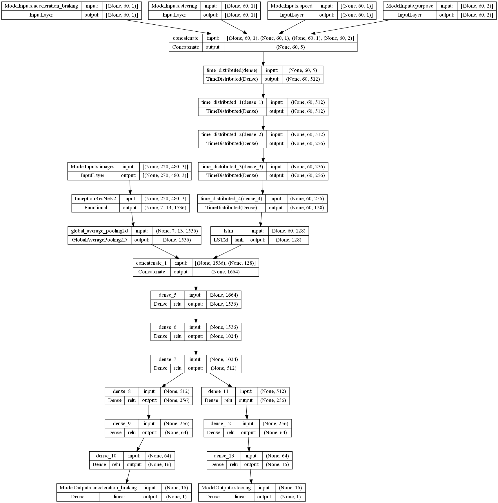

*Tensorboard logs:*  
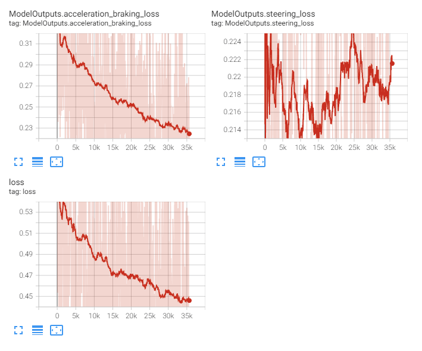

This model is quite similar to the [`model_0007_inceptionresnetv2_v1`](../model_0007_inceptionresnetv2) and differs in the fact it wraps the fully-connected layers processing additional (history) input data with `TimeDistributed` layers and adds a single `LSTM` layer after this and before the concatenation with the CNN backbone output. The RNN part can ensure we process the input data while keeping the temporal aspect (making use of the fact the data is time-distributed). In a summary, this model's architecture consists of the [`InceptionResNetv2`](../project_info/inceptionresnetv2.md) model as the CNN backbone and 4 additional inputs (acceleration/braking, steering, speed, and purpose) that are concatenated and fed through the 5 time-distributed, fully-connected layers before being passed through the `LSTM` layer and concatenated to the CNN backbone output. After concatenation, the model consists of 3 fully-connected layers (to allow the model to learn non-linear features in the concatenated data from both sources in the common model part). The heads are unchanged compared to the last models and are consisting of 3 densely-connected layers each with the number of neurons in each of the consecutive layers being divided by 4, and the output layers for each of the regression outputs.

To be able to feed this model we had to change the input data a bit, mainly reverse the data order to keep the history samples ordered from the oldest to the newest. Additionally, the data of the feature called the purpose have been extended from 1 to 60 last samples to match the rest of the inputs (since we're processing all of the inputs together by concatenating the data in the last dimension - this can be visualized as taking columns of the data and making them a table with the oldest samples at the top and the newest on the bottom).

The idea here is to add the temporal aspect to the history data being processed in the model by wrapping the fully-connected layers with time-distributed ones to put and process the history data in chronological order. After this, we added a single LSTM layer to only take the last prediction instead of predictions at all of the timestamps - we want to only know the state at the current point of time and use it along with the CNN backbone output to make a prediction.

This model, despite being trained for 35,000 batches, did not start steering at all, like the history data processed this way might be "confusing" the model during training. We stopped training it to try the other approach we've had in our minds before trying to draw any conclusions here.

This model was also where and when we discovered that we are using the current steering values (which are the outputs of the model, or the model’s prediction) also as the last value in the input history data sequence. This is an obvious mistake and the history data should be truly historical only. With this mistake, the model could easily learn during training to predict this value as output value as they were always identical, and for the inference, it would predict the last previous value. past. This means previous attempts of using historical data, like in the [`model_0001_xception`](../model_0001_xception) or [`model_0007_inceptionresnetv2`](../model_0007_inceptionresnetv2) model lines were incorrect.

This model has not been streamed.

 
 

## model_0008_irv2_data_td_v2

Training periods: `May 24th-25th` (batches: *0-19000*, off-stream)  
Training batches (total): *19000*

*Model summary:*  
- Total params: `59,885,474`
- Trainable params: `59,824,930`
- Non-trainable params: `60,544`

*Model architecture:*  
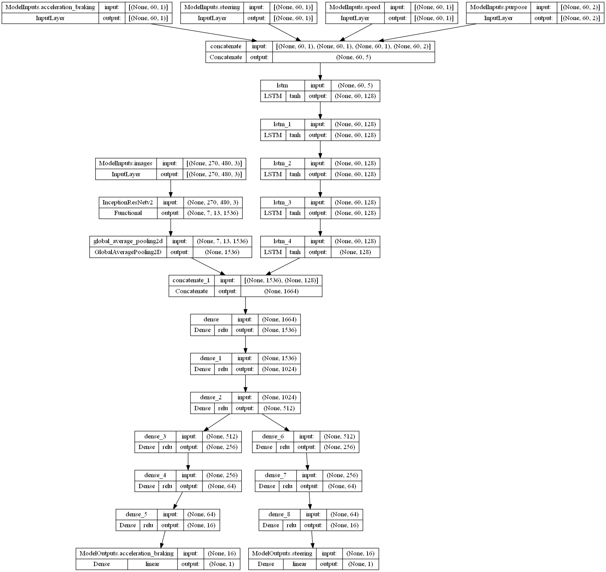

*Tensorboard logs:*  
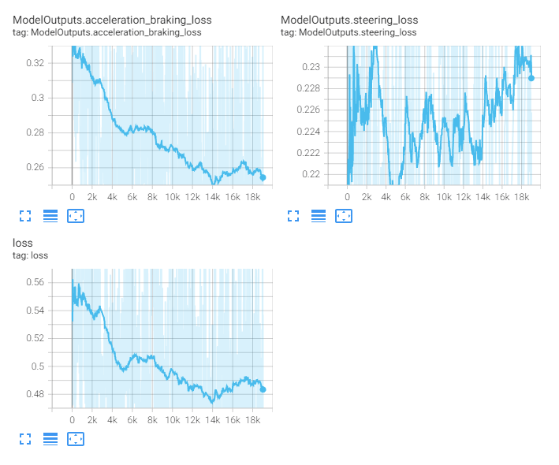

This model has been made by modifying the [`model_0008_irv2_data_td_v1`](#model_0008_irv2_data_td_v1) model in a way that time-distributed and fully-connected layers were replaced with the `LSTM` layers. In a summary, this model's architecture consists of the [`InceptionResNetv2`](../project_info/inceptionresnetv2.md) model as the CNN backbone and 4 additional inputs (acceleration/braking, steering, speed, and purpose) that are being concatenated and fed through the 5 `LSTM` layers and concatenated to the CNN backbone output. After concatenation, the model consists of 3 fully-connected layers (to allow the model to learn non-linear features in the concatenated data from both sources). The heads are unchanged compared to the last models and are consisting of 3 densely-connected layers each with the number of neurons in each of the consecutive layers being divided by 4, and the output layers for each of the regression outputs.

We wanted to try if using `LSTM` layers instead of the time-distributed fully-connected layers can have any effect on the model training. The last of the LSTM layers is set to not return a sequence of predictions (for each time step) but just the last prediction similarly to the [`model_0008_irv2_data_td_v1`](#model_0008_irv2_data_td_v1).

This model did not show any signs of making the training faster and the steering loss started rising at some point.

This model has not been streamed.

 
 

## model_0008_irv2_data_td_v3

Training periods: `May 24th-25th` (batches: *0-19000*, off-stream)  
Training batches (total): *19000*

*Model summary:*  
- Total params: `59,935,010`
- Trainable params: `59,874,466`
- Non-trainable params: `60,544`

*Model architecture:*  
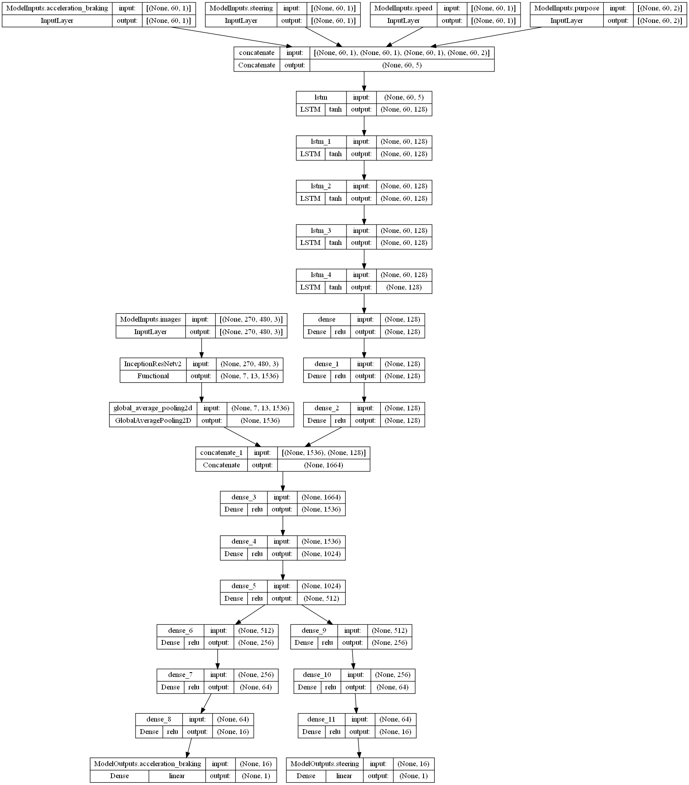

*Tensorboard logs:*  
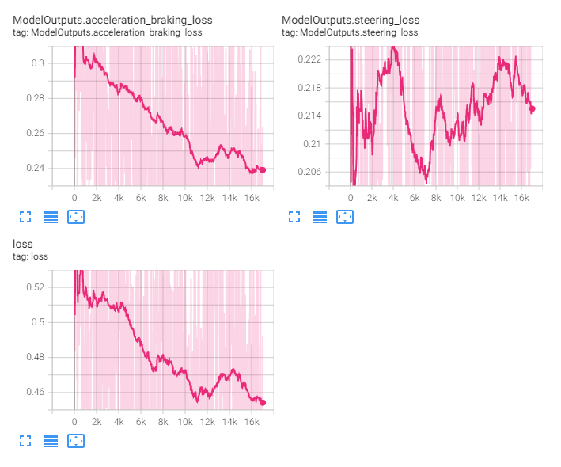

This model has been created by modifying the [`model_0008_irv2_data_td_v2`](#model_0008_irv2_data_td_v2) model in a way it adds fully-connected layers in the data history input after the `LSTM` layers and before the concatenation with the CNN backbone output. In a summary, this model's architecture consists of the [`InceptionResNetv2`](../project_info/inceptionresnetv2.md) model as the CNN backbone and 4 additional inputs (acceleration/braking, steering, speed, and purpose) that are concatenated and fed through the 5 `LSTM` layers before being passed through the 3 fully-connected layers and concatenated to the CNN backbone output. After concatenation, the model consists of 3 fully-connected layers (to allow the model to learn non-linear features in the concatenated data from both sources). The heads are unchanged compared to the last models and are consisting of 3 densely-connected layers each with the number of neurons in each of the consecutive layers being divided by 4, and the output layers for each of the regression outputs.

This model is a variation of the [`model_0008_irv2_data_td_v2`](#model_0008_irv2_data_td_v2) (adds some densely-connected layers in the RNN input branch after the `LSTM` layers) model and has been trained in parallel to the mentioned model. Additional fully-connected layers did not help and potentially made the steering loss even worse (higher). After this, we started wondering if maybe we can help the model by adding regularization to the history data input.

This model has not been streamed.

 
 

## model_0008_irv2_data_td_v4

Training periods: `May 25th-28th` (batches: *0-35500*, off-stream)  
Training batches (total): *35500*

*Model summary:*  
- Total params: `59,946,228`
- Trainable params: `59,885,684`
- Non-trainable params: `60,544`

*Model architecture:*  
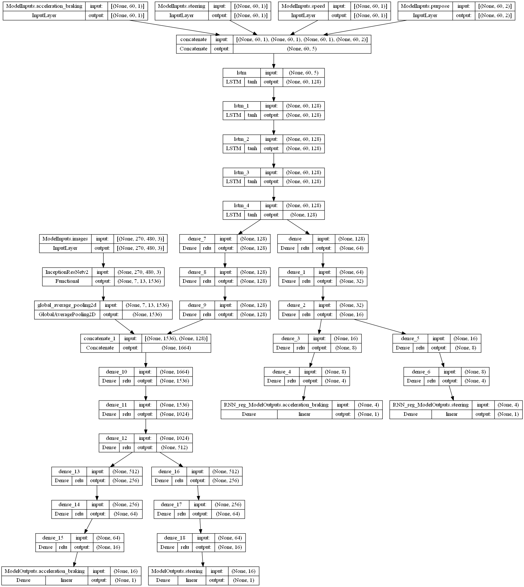

*Tensorboard logs:*  
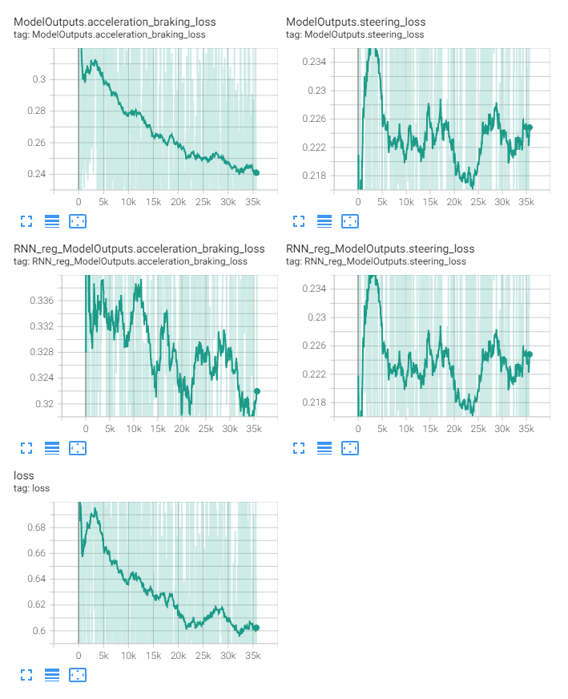

This model's base is the same as the [`model_0008_irv2_data_td_v3`](#model_0008_irv2_data_td_v3) model, but the difference is that after the last of the `LSTM` layers we attached additional fully-connected layers and additional heads being the same outputs as the main model outputs. In a summary, this model's architecture consists of the [`InceptionResNetv2`](../project_info/inceptionresnetv2.md) model as the CNN backbone and 4 additional inputs (acceleration/braking, steering, speed, and purpose) that are concatenated and fed through the 5 `LSTM` layers before being passed through the 3 fully-connected layers and concatenated to the CNN backbone output. After concatenation, the model consists of 3 fully-connected layers (to allow the model to learn non-linear features in the concatenated data from both sources). The heads are unchanged compared to the last models and are consisting of 3 densely-connected layers each with the number of neurons in each of the consecutive layers being divided by 4, and the output layers for each of the regression outputs. Additionally, after the last of the `LSTM` layers, there are additional 3 fully-connected layers (but containing fewer neurons) connected to 2 additional heads (also consisting of fewer layers and neurons) acting as a regularization output.

With this model, we wanted to try to regularize the history data input part of the model (in case it does not learn well due to the CNN part being concatenated to it and possibly the gradient flow issues) by attaching additional, auxiliary outputs, the same as the main outputs (but omitting the CNN part in the backpropagation). This way the RNN part could be partially trained straight on the output values not being influenced by the CNN part. The loss coefficient for the losses associated with these outputs was set to *0.25*, which means only 1/4th of the gradients calculated this way will be used to train the RNN part (next to full gradients calculated by backpropagation from the main outputs). We weren't sure if maybe the model tries to ignore the RNN part if it is "more confusing" and we thought regularization here might help. It didn't, the model did not learn to steer still.

This model has not been streamed.

 
 

## model_0008_irv2_data_td_v5

Training periods: `May 25th-26th` (batches: *0-37250*, off-stream)  
Training batches (total): *37250*

*Model summary:*  
- Total params: `606,162`
- Trainable params: `606,162`
- Non-trainable params: `0`

*Model architecture:*  
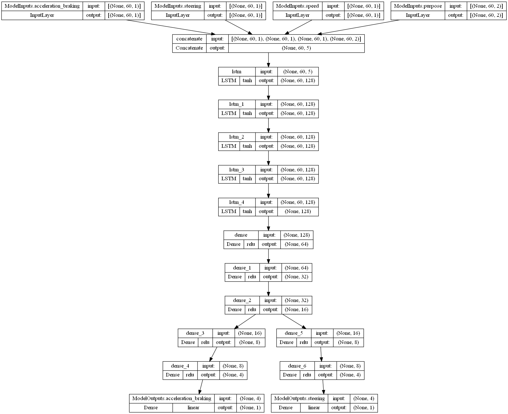

*Tensorboard logs:*  
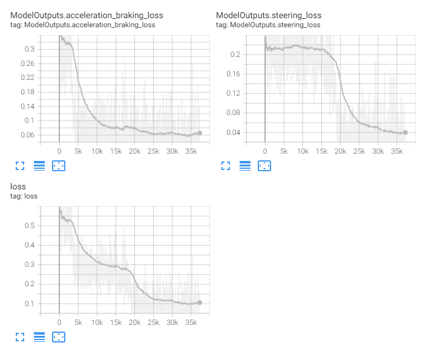

This model is based on the [`model_0008_irv2_data_td_v4`](#model_0008_irv2_data_td_v4) model and differs in a lack of the CNN part and DNN part with what was the regularization in the base model being now the main output. Its architecture consists of the 4 history inputs (acceleration/braking, steering, speed, and purpose) that are being concatenated and fed through the 5 `LSTM` layers before being passed through the 3 fully-connected layers. The heads used are the regularization heads from the [`model_0008_irv2_data_td_v4`](#model_0008_irv2_data_td_v4) model.

Since all of the models in this lineup did not learn, we wanted to check if the model can learn anything from the history data only. Of course, whatever it'll learn won't be enough to drive as the model would only see past steering (which it's also invoking during inference), speed, and the purpose which is not enough to do so as the model would not see anything from the environment - would not "know" where it is, what's in front of the car, etc. Driving was not a purpose of this model and we never ran the inference on it. We only wanted to see the loss.

With this model, we were able to decrease the loss of the acceleration/braking and later the steering output which means the model can and should use this data reliably. Surprisingly the model converged on the steering input as late as on the pure CNN model, but while it's using both inputs (CNN/images and RNN/history) at the same time, it does not converge even after a much longer period. Maybe we should train these models even longer? It can also be a thing that what this model has learned is mostly to predict a similar steering value to the most recent one since they will usually be pretty similar.

This model has been trained in parallel to the [`model_0008_irv2_data_td_v4`](#model_0008_irv2_data_td_v4) (started training shortly after it). Since it only consisted of a rather small RNN part, it has been training significantly quicker than the other models.

At this point we thought maybe using the last `LSTM`'s layer prediction is not what we should be using - maybe we do not need a prediction but a state vector (called also thought vector) being a representation of the historical data and maybe this combined with the representation of the CNN data would make a better model.

After training this model we moved to the [`model_0009_irv2_cr_tl`](../model_0009_irv2_cr_tl) lineup instead to try some transfer learning on the CNN and RNN part (using our pre-trained parameters) of the model and compare the results, then switched to streaming the [`model_0004_inceptionresnetv2_v3`](../model_0004_inceptionresnetv2) model again. We revisited this lineup later checking 2 more (following) models.

This model has not been streamed.

 
 

## model_0008_irv2_data_td_v6

Training periods: `June 9th-10th` (batches: *0-45250*, off-stream)  
Training batches (total): *45250*

*Model summary:*  
- Total params: `606,162`
- Trainable params: `606,162`
- Non-trainable params: `0`

*Model architecture:*  

*Tensorboard logs:*  
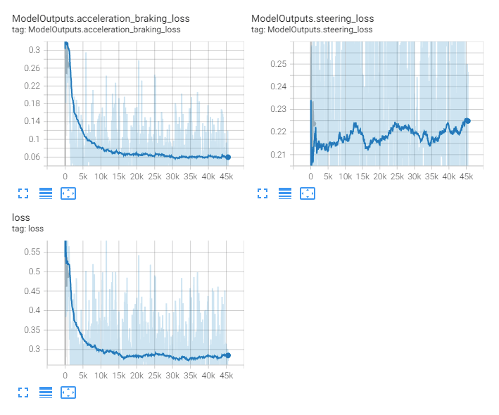

This model is almost identical to the [`model_0008_irv2_data_td_v5`](#model_0008_irv2_data_td_v5) model but uses the thought vector instead of the prediction of the last `LSTM` layer. Its architecture consists of the 4 history inputs (acceleration/braking, steering, speed, and purpose) that are being concatenated and fed through the 5 `LSTM` layers before the thought vector of the last `LSTM` layer is passed through the 3 fully-connected layers. The heads used are the regularization heads from the [`model_0008_irv2_data_td_v4`](#model_0008_irv2_data_td_v4) model.

In this model, we wanted to see if there is any difference or if the model can even learn anything if instead of the prediction of the last `LSTM` we use its hidden state vector called also though vector. We might not need (or even not want) a prediction of the LSTM layer as it can be completely unrelated to what the "CNN" part “thinks” and this might be causing the inability of this model lineup to learn anything (what we also observed). If, however, instead of using the prediction we take the thought vector which should be history data interpretation and representation (instead of a prediction of a future action), this combined with the CNN backbone representation of the visual part might finally provide better predictions. The thinking behind this is that the thought vector being history data representation might be more useful instead of the RNN prediction, which might be incorrect, not helpful, or even rather confusing.

This model, again, did not figure out the steering part, but the cause might be that in this configuration, the thought vector might be not enough for the fully-connected layers to find the solution. Normally, the RNN part would predict itself, and maybe with a thought vector instead of a prediction we should try CNN and RNN parts together again, but using this thought vector.

This model has not been streamed.

 
 

## model_0008_irv2_data_td_v7

Training periods: `June 10th-13th` (batches: *0-75000*, off-stream)  
Training batches (total): *75000*

*Model summary:*  
- Total params: `58,311,074`
- Trainable params: `58,250,530`
- Non-trainable params: `60,544`

*Model architecture:*  
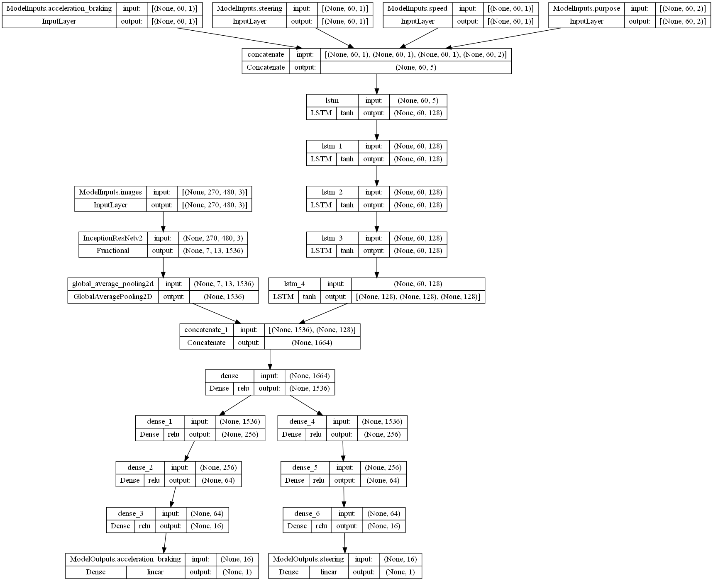

*Tensorboard logs:*  
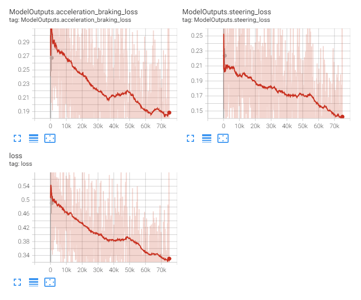

This model is based on the [`model_0008_irv2_data_td_v2`](#model_0008_irv2_data_td_v2) model, with the only difference being instead of using the last `LSTM` layer prediction we're using the thought vector. In a summary, this model's architecture consists of the [`InceptionResNetv2`](../project_info/inceptionresnetv2.md) model as the CNN backbone and 4 additional inputs (acceleration/braking, steering, speed, and purpose) that are being concatenated and fed through the 5 `LSTM` layers and the thought vector of the last `LSTM` layer is being concatenated to the CNN backbone output. After concatenation, the model consists of 3 fully-connected layers (to allow the model to learn non-linear features in the concatenated data from both sources). The heads are unchanged compared to the previous models (pre-regularization) and are consisting of 3 densely-connected layers each with the number of neurons in each of the consecutive layers being divided by 4, and the output layers for each of the regression outputs.

If we compare this model to the [`model_0004_inceptionresnetv2_v3`](../model_0004_inceptionresnetv2), our best model at this point (using only the CNN part), the loss looks quite similar:  
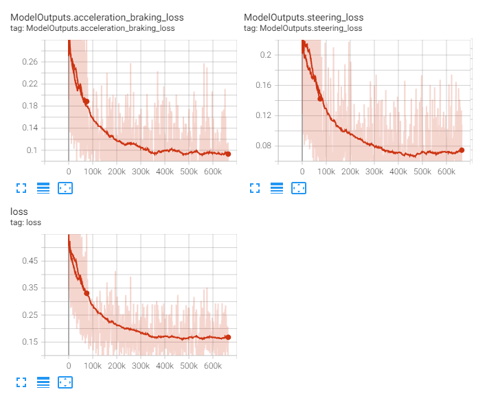  
Unfortunately, both model losses are being drawn with the same line color in this case, but the shorter plot is this current model. While for the [`model_0004_inceptionresnetv2_v3`](../model_0004_inceptionresnetv2) model steering started converging after 22,000 batches, in this case, the RNN part using the thought vector probably positively affects this model as steering started converging almost instantly and at about 9,000 batches, when we checked the driving, the model was able to steer (it was steering like in a young model, but was not stuck at predicting a single value as in the [`model_0004_inceptionresnetv2_v3`](../model_0004_inceptionresnetv2) after this number of batches).

This could possibly be our new best model, but at the time we stopped training it, we already knew that the difference between this and the [`model_0004_inceptionresnetv2_v3`](../model_0004_inceptionresnetv2) (our best so far model) would not be as big as we would want to and we finalized a new model architecture idea already ([`model_0012_regnet`](../model_0012_regnet)) which will further be expanded with a new memory approach so we opted to keep training and streaming the [`model_0004_inceptionresnetv2_v3`](../model_0004_inceptionresnetv2) to see how far we can push it.

This model has not been streamed.
