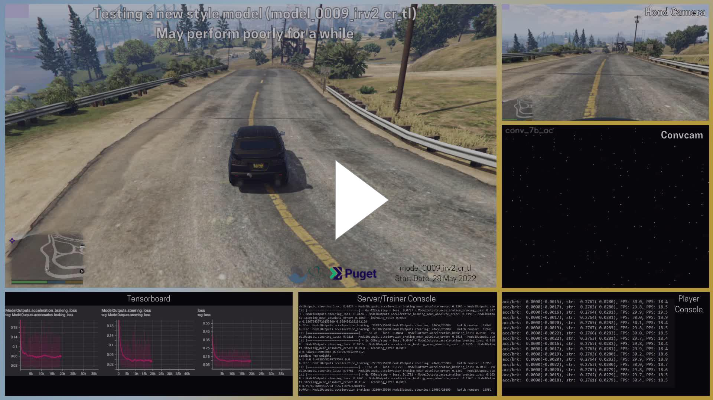
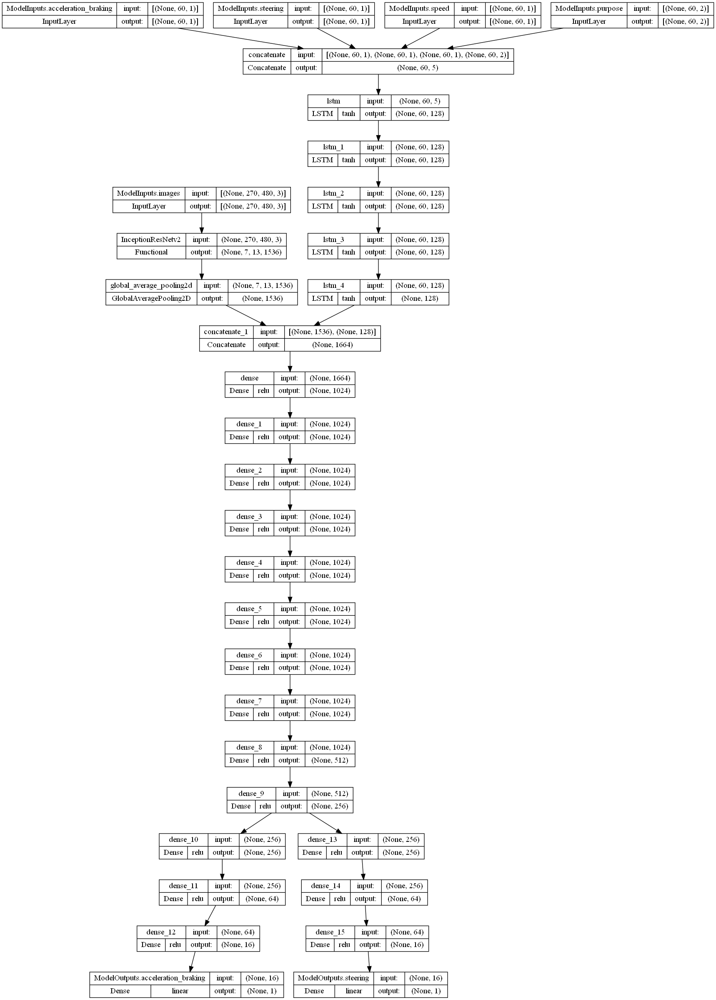
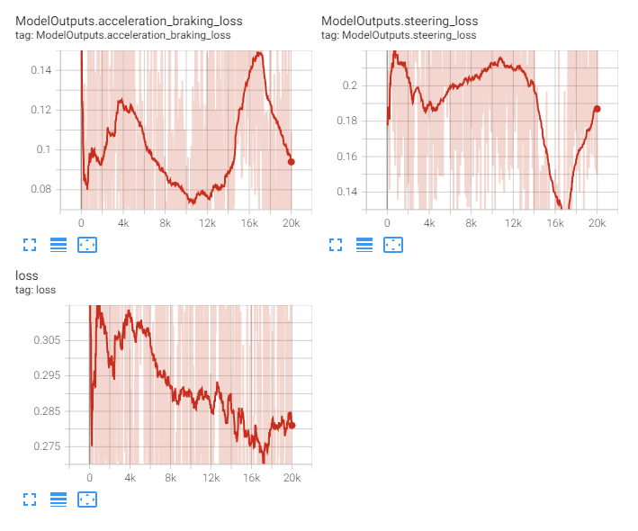
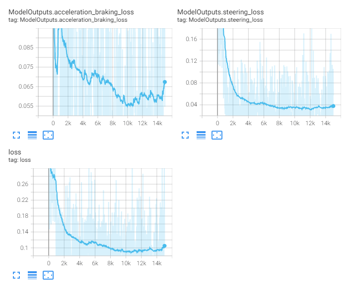
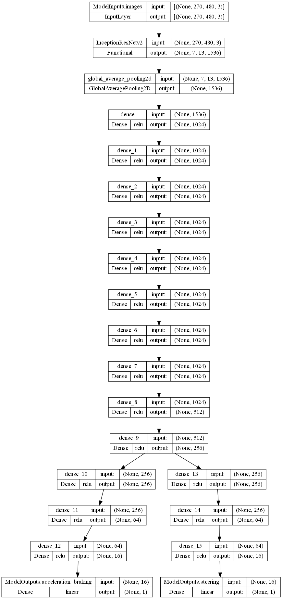
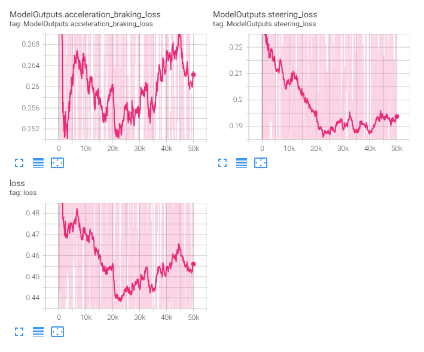
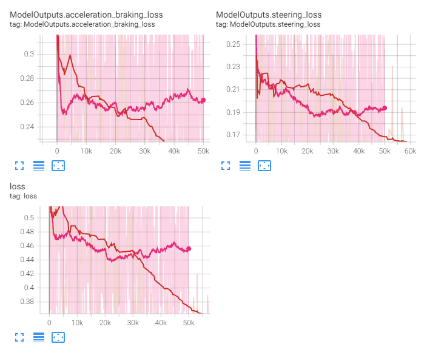
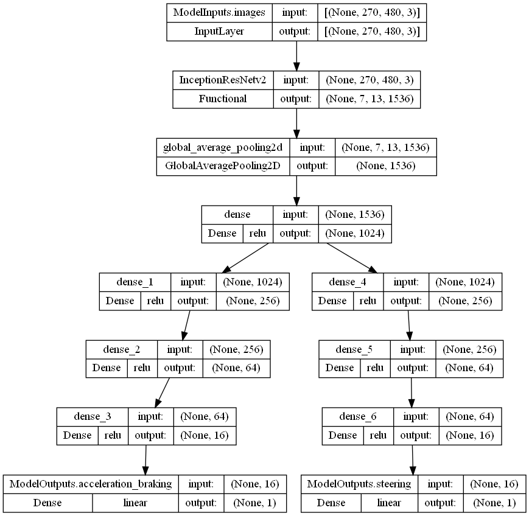
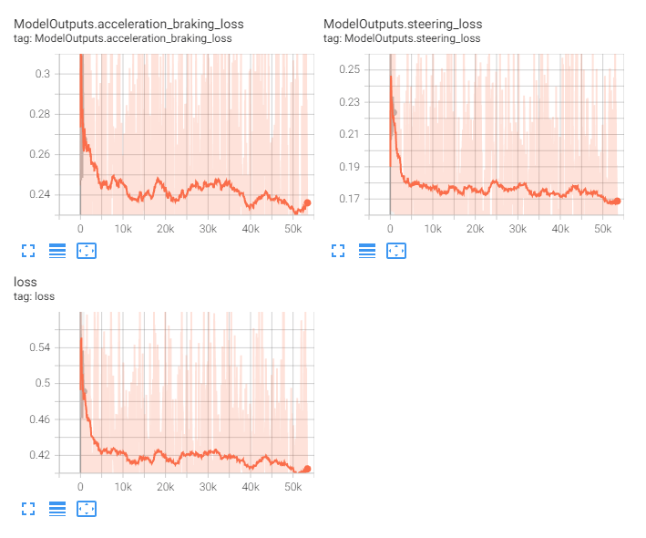

<< [Back](../../../)

# model_0009_irv2_cr_tl

This model line architecture is identical to the [`model_0008_irv2_data_td`](../model_0008_irv2_data_td). It was extended to support transfer learning. `irv2` stands for [`InceptionResNetv2`](../project_info/inceptionresnetv2.md), `cr` for `CNN/RNN` and `tl` for `transfer-learning`.

## List of the models:
- [`model_0009_irv2_cr_tl_v1`](#model_0009_irv2_cr_tl_v1)
- [`model_0009_irv2_cr_tl_v2`](#model_0009_irv2_cr_tl_v2)
- [`model_0009_irv2_cr_tl_v3`](#model_0009_irv2_cr_tl_v3)
- [`model_0009_irv2_cr_tl_v4`](#model_0009_irv2_cr_tl_v4)
- [`model_0009_irv2_cr_tl_v5`](#model_0009_irv2_cr_tl_v5)

 
 

## model_0009_irv2_cr_tl_v1

Training periods: `May 28th-29th` (batches: *0-19250*, streamed)  
Training batches (total): *19250*

*Model summary:*  
- Total params: `59,935,010`
- Trainable params: `59,874,466`
- Non-trainable params: `60,544`

*Model architecture:*  

*Tensorboard logs:*  

This model is identical to the [`model_0008_irv2_data_td_v3`](../model_0008_irv2_data_td) model. Its architecture consists of the [`InceptionResNetv2`](../project_info/inceptionresnetv2.md) model as the CNN backbone and 4 additional inputs (acceleration/braking, steering, speed, and purpose) that are being concatenated and fed through the 5 `LSTM` layers before being passed through the 3 fully-connected layers and concatenated to the CNN backbone output. After concatenation, the model consists of 3 fully-connected layers (to allow the model to learn non-linear features in the concatenated data from both sources). The heads are unchanged compared to the last models and are consisting of 3 densely-connected layers each with the number of neurons in each of the consecutive layers being divided by 4, and the output layers for each of the regression outputs.

This model has been created and trained before the [`model_0008_irv2_data_td_v6`](../model_0008_irv2_data_td) and [`model_0008_irv2_data_td_v7`](../model_0008_irv2_data_td) models which are using the thought vector instead of the prediction in the RNN input branch.

As a transfer-learning model, it is using following model parameters:
- [`model_0004_inceptionresnetv2_v3`](../model_0004_inceptionresnetv2) (the best CNN-only model) at batch `27500` for the CNN part, only the [`InceptionResNetv2`](../project_info/inceptionresnetv2.md) layers; the batch number has been chosen right after the losses of this model, especially the steering loss, have started falling
- [`model_0008_irv2_data_td_v5`](../model_0008_irv2_data_td) (the RNN-only model) at batch `18500` for the RNN part, only the LSTM layers; the batch number has been chosen right after the losses of this model, especially the steering loss, have started falling
- all other layers (the fully-connected layers after the `LSTM` layers and all after the concatenation, including heads) were initialized randomly

None of the layers has been frozen letting the model train both CNN and RNN parts further.

The idea here was to use pre-trained CNN and RNN parts of the model so the model does not start blank and does not use any regularization/auxiliary input. The thinking behind this was the model might start converging faster and "figure out" to use both inputs at the same time. It, however, quickly figured to fit the RNN part only and never really use the CNN part. As we’ll know from the later model, [`model_0008_irv2_data_td_v6`](../model_0008_irv2_data_td) and [`model_0008_irv2_data_td_v7`](../model_0008_irv2_data_td) models, it's been mostly because the model figured to use the RNN part's prediction to lower the loss quickly as it was the easiest way to make it low, much lower than what could be achieved by the CNN part alone. This did not mean a better model - lower loss has only been a result of a "shortcut" to lower the loss and the car has been mostly repeating last action (using the RNN part's prediction), for example driving in circles.

*An example of described behavior:*  
  

This model has been streamed fully and since it did not learn, we switched to streaming the [`model_0004_inceptionresnetv2_v3`](../model_0004_inceptionresnetv2) model and have been checking other possibilities off-stream.

 
 

## model_0009_irv2_cr_tl_v2

Training periods: `May 28th-30th` (batches: *0-20000*, off-stream)  
Training batches (total): *20000*

*Model summary:*  
- Total params: `64,806,562`
- Trainable params: `64,746,018`
- Non-trainable params: `60,544`

*Model architecture:*  

*Tensorboard logs:*  

This model is based on the [`model_0009_irv2_cr_tl_v1`](#model_0009_irv2_cr_tl_v1) model but removes 3 fully-connected layers after the RNN part and before concatenation, and extends 3 common fully-connected layers to 9. In a summary, its architecture consists of the [`InceptionResNetv2`](../project_info/inceptionresnetv2.md) model as the CNN backbone and 4 additional inputs (acceleration/braking, steering, speed, and purpose) that are being concatenated and fed through the 5 `LSTM` layers before being concatenated with the CNN backbone output. After concatenation, the model consists of 9 fully-connected layers (to allow the model to learn non-linear features in the concatenated data from both sources). The heads are unchanged compared to the last models and are consisting of 3 densely-connected layers each with the number of neurons in each of the consecutive layers being divided by 4, and the output layers for each of the regression outputs.

As a transfer-learning model, it is using following model parameters:
- [`model_0004_inceptionresnetv2_v3`](../model_0004_inceptionresnetv2) (the best CNN-only model) at batch *27500* for the CNN part, only the [`InceptionResNetv2`](../project_info/inceptionresnetv2.md) layers; the batch number has been chosen right after the losses of this model, especially the steering loss, have started falling
- [`model_0008_irv2_data_td_v5`](../model_0008_irv2_data_td) (the RNN-only model) at batch *18500* for the RNN part, only the LSTM layers; the batch number has been chosen right after the losses of this model, especially the steering loss, have started falling
- all other layers (all the fully-connected layers after the concatenation, including heads) were initialized randomly

None of the layers has been frozen letting the model train both CNN and RNN parts further.

The idea with this model (again, before we came up with the idea of using the thought vector) was that maybe the model needs more capacity after concatenation to figure out the data. It started fitting to the RNN part again but slower giving the illusory impression of fitting to the data better. It did not learn to stick to a single action as the [`model_0009_irv2_cr_tl_v1`](#model_0009_irv2_cr_tl_v1) but this might be because it's been significantly harder for this model to learn because of more of the Dense layers compared to previous attempts.

This model has not been streamed.

 
 

## model_0009_irv2_cr_tl_v3

Training periods: `May 30th-31th` (batches: *0-15000*, off-stream)  
Training batches (total): *15000*

*Model summary:*  
- Total params: `64,806,562`
- Trainable params: `9,874,882`
- Non-trainable params: `54,931,680`

*Model architecture:*  

*Tensorboard logs:*  

This model is identical to the [`model_0009_irv2_cr_tl_v2`](#model_0009_irv2_cr_tl_v2) model. It only differs in what weights have been used to initialize it.

As a transfer-learning model, it is using following model parameters:
- [`model_0004_inceptionresnetv2_v3`](../model_0004_inceptionresnetv2) (the best CNN-only model) at batch *211250* for the CNN part, only the [`InceptionResNetv2`](../project_info/inceptionresnetv2.md) layers; it's the latest batch of the [`model_0004_inceptionresnetv2_v3`](../model_0004_inceptionresnetv2) model (which also has been streamed and trained at this time)
- [`model_0008_irv2_data_td_v5`](../model_0008_irv2_data_td) (the RNN-only model) at batch *37250* for the RNN part, only the LSTM layers; it's the latest batch of this model
- all other layers (all the fully-connected layers after the concatenation, including heads) were initialized randomly

The transfer-learned layers have been frozen this time letting the model only train the remaining fully-connected layers.

With this model, we wanted to see, if we take the trained CNN and trained RNN part, the model will learn any better than the previous one. This has also been before we figured out we rather want to use the thought vector for the RNN part. We froze the transfer-learned parts so the training won't change them (for example make to un-learn anything, and we knew the CNN part is already decently trained with these weights). It, however, did not learn anything useful, even acceleration and braking which was never a problem so far. The reason for this might be multiple fully-connected layers and a confusing RNN part (which we figured out later with the thought vector idea) next to a decently-trained CNN part.

This model has not been streamed.

 
 

## model_0009_irv2_cr_tl_v4

Training periods: `May 31th - Jun 1st` (batches: *0-50000*, off-stream)  
Training batches (total): *50000*

*Model summary:*  
- Total params: `64,080,546`
- Trainable params: `9,743,810`
- Non-trainable params: `54,336,736`

*Model architecture:*  

*Tensorboard logs:*  

This model follows the [`model_0009_irv2_cr_tl_v3`](#model_0009_irv2_cr_tl_v3) model's architecture but has the RNN part removed leaving only the CNN part in the model. Its architecture consists only of the [`InceptionResNetv2`](../project_info/inceptionresnetv2.md) model as the CNN backbone, after which there are 9 fully-connected layers (to allow the model to learn non-linear features in the concatenated data from both sources). The heads are unchanged compared to the last models and are consisting of 3 densely-connected layers each with the number of neurons in each of the consecutive layers being divided by 4, and the output layers for each of the regression outputs.

As a transfer-learning model, it is using following model parameters:
- [`model_0004_inceptionresnetv2_v3`](../model_0004_inceptionresnetv2) (the best CNN-ony model) at batch *211250* for the CNN part, only the [`InceptionResNetv2`](../project_info/inceptionresnetv2.md) layers; it's the same batch as used with the [`model_0009_irv2_cr_tl_v3`](#model_0009_irv2_cr_tl_v3) model for direct comparison
- all other layers were initialized randomly

The transfer-learned layers have been frozen this time letting the model only train the remaining fully-connected layers.

The reason for this test was to see if the model can quickly train the fully-connected layers with the CNN part being already trained (initialized with trained parameters) and frozen. As the previous model, which has also been using the RNN part, did not learn, we wanted to confirm a plain-CNN model can indeed learn while using transfer learning.

*Loss comparison between this model and the [`model_0004_inceptionresnetv2_v3`](../model_0004_inceptionresnetv2) which we knew works well:*

The loss of this model initially decreased quickly and the model has never been stuck with steering, but with the CNN part frozen it did not learn further. It learned to steer and drive in general, like trying to stay on the line, avoid obstacles, etc. This proved the RNN part was always confusing for the model. This model did not learn as well as the model we took the weights from, though (might be because of more of the fully-connected layers which did not help the model and on a contrary made it worse, or just makes the training harder and the model would need more time to train to the same level). Later, with the [`model_0008_irv2_data_td_v6`](../model_0008_irv2_data_td) and [`model_0008_irv2_data_td_v7`](../model_0008_irv2_data_td) models, we figured out that maybe the thought vector of the `LSTM` layer is what we should use instead of the prediction. We never attempted to train this with the CNN parameters not being frozen for comparison if the model will train further.

This model has not been streamed.

 
 

## model_0009_irv2_cr_tl_v5

Training periods: `Jun 3rd-4th` (batches: *0-52500*, off-stream)  
Training batches (total): *52500*

*Model summary:*  
- Total params: `56,470,434`
- Trainable params: `2,133,698`
- Non-trainable params: `54,336,736`

*Model architecture:*  

*Tensorboard logs:*  

This model architecture is based on the [`model_0009_irv2_cr_tl_v4`](#model_0009_irv2_cr_tl_v4) but reduces the number of fully-connected layers to match exactly the [`model_0009_irv2_cr_tl_v3`](#model_0009_irv2_cr_tl_v3) model. Its architecture consists only of the [`InceptionResNetv2`](../project_info/inceptionresnetv2.md) model as the CNN backbone, after which there are 3 fully-connected layers (to allow the model to learn non-linear features in the concatenated data from both sources). The heads are unchanged compared to the last models and are consisting of 3 densely-connected layers each with the number of neurons in each of the consecutive layers being divided by 4, and the output layers for each of the regression outputs.

As a transfer-learning model, it is using following model parameters:
- [`model_0004_inceptionresnetv2_v3`](../model_0004_inceptionresnetv2) (the best CNN-ony model) at batch *211250* for the CNN part, only the [`InceptionResNetv2`](../project_info/inceptionresnetv2.md) layers; it's the same batch as used with the [`model_0009_irv2_cr_tl_v3`](#model_0009_irv2_cr_tl_v3) and [`model_0009_irv2_cr_tl_v4`](#model_0009_irv2_cr_tl_v4) models for direct comparison
- all other layers were initialized randomly

Transfer-learned layers have been frozen this time letting the model only train the remaining fully-connected layers.

Since we achieved mixed results with the [`model_0009_irv2_cr_tl_v4`](#model_0009_irv2_cr_tl_v4) containing more fully-connected layers, we re-created exactly the [`model_0004_inceptionresnetv2_v3`](../model_0004_inceptionresnetv2) model to see if it'll transfer learn easily from own weights. In theory, it should as it'll only have to train the fully-connected layers since the CNN part is already decently trained and frozen. This model learned some things but is not as good as the model trained fully from scratch (that we took parameters from). It decreased loss initially rather quickly but then never learned further. We haven’t attempted to train it with the CNN part not being frozen. We are not sure why it did not learn better. It is possible it might need more time to train the DNN part but this would argue the benefits of using transfer learning.

This model has not been streamed.
