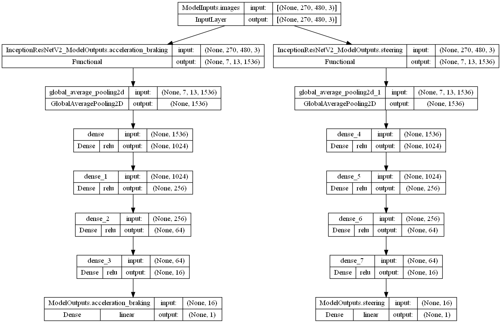

<< [Back](../../../)

# model_0010_irv2_tcb

This model line is based on the [`model_0004_inceptionresnetv2`](../model_0004_inceptionresnetv2). It introduces 2 separate CNN backbones (and no additional other/history data inputs). None of the models of this line has ever been created and tested (trained). `irv2` stands for [`InceptionResNetv2`](../project_info/inceptionresnetv2.md), `tcb` for `two CNN backbones`.

This model is supposed to be a test if 2 separate backbones for each output can learn better. We never trained it busy with other, more promising ideas and problem-solving.

*Model summary:*  
- Total params: `112,381,058`
- Trainable params: `112,259,970`
- Non-trainable params: `121,088`

*Model architecture:*  

