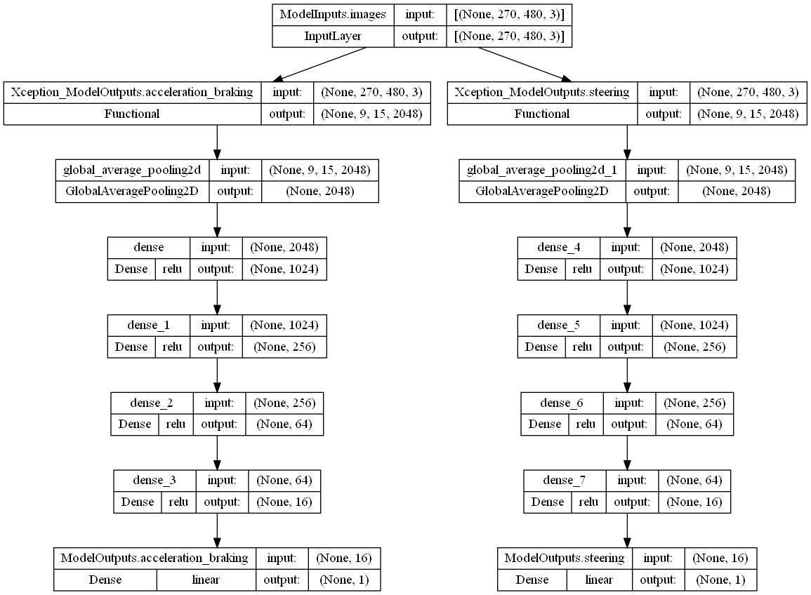

<< [Back](../../../)

# model_0011_x_tcb

This model line is based on the [`model_0003_xception`](../model_0003_xception). It introduces 2 separate CNN backbones (and no additional other/history data inputs). None of the models of this line has ever been created and tested (trained). `x` stands for [`Xception`](../project_info/xception.md), `tcb` for `two CNN backbones`.

This model is supposed to be a test if 2 separate backbones for each output can learn better. We never trained it busy with other, more promising ideas and problem-solving.

*Model summary:*  
- Total params: `46,479,122`
- Trainable params: `46,370,066`
- Non-trainable params: `109,056`

*Model architecture:*  

