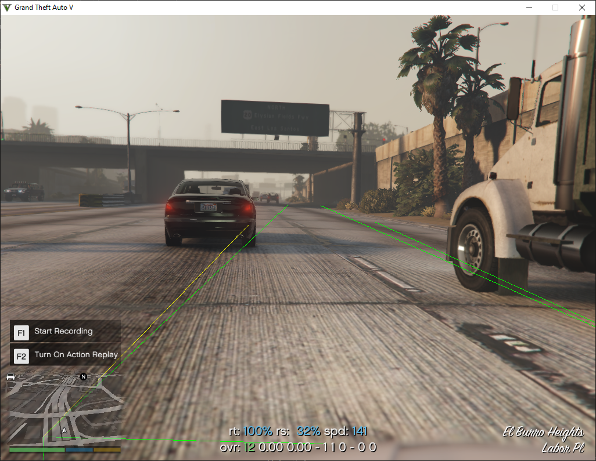
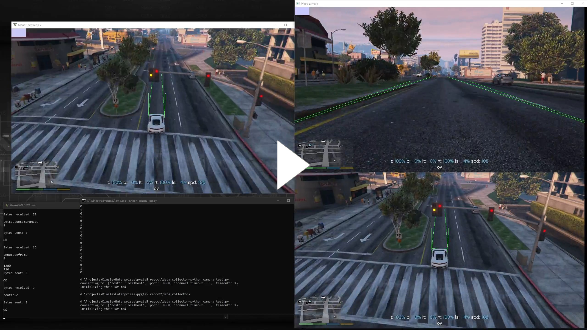

<< [Back](../../../)

# NPCs

To collect the training data, we've created the custom NPCs that drive however we instruct them to (via our custom GTA5 game mod), playing in the additional GTA5 instances we're running off-stream. The accompanying Python code collects steering and other inputs as well as images and after some processing and [`Balancing`](../project_info/data_balancing.md), they're sent to the [`Trainer`](../project_info/system.md).

NPCs are based on the in-game AI but set in specific ways that the player never approach while playing the game. The behavior can be also controlled by us and is changing depending on a situation. Additionally, we're using custom proximity sensors to help the NPC "brain" avoid crashes. Said sensors are only being used to override the NPCs' behavior and are not used for anything else (including they're not used to train the model).

The visualization of these sensors (this screenshot as well as the below video) was taken before the final NPC version has been done):

The below video also shows off pre-final NPC version but is fairly accurate to how NPCs are playing.

  

We’re also using additional overrides and custom logic for these data colletors to make them generate the exact data we need. We have a list of updates to the AI to be implemented for future data collecting.