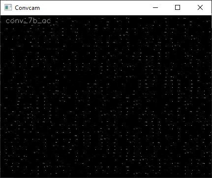
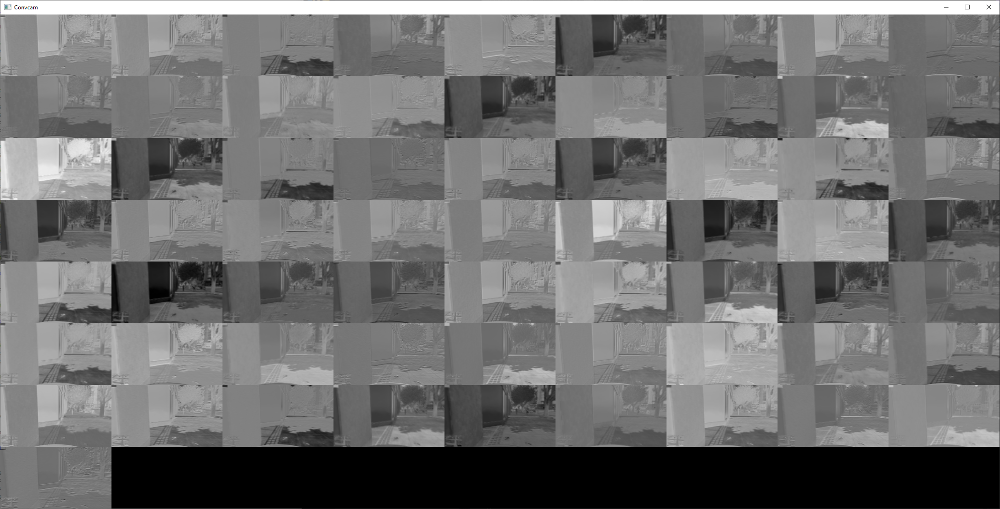
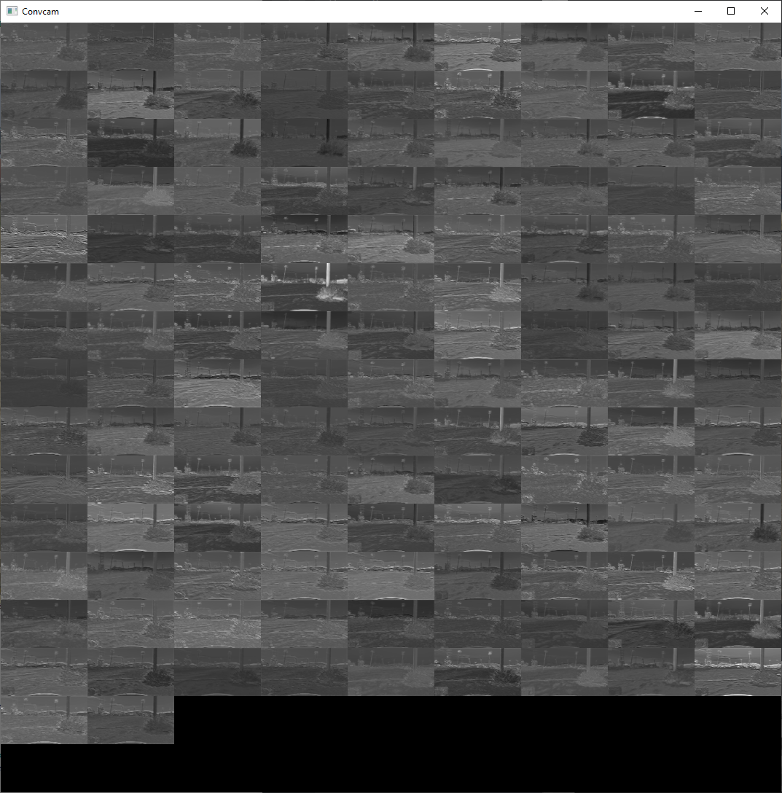
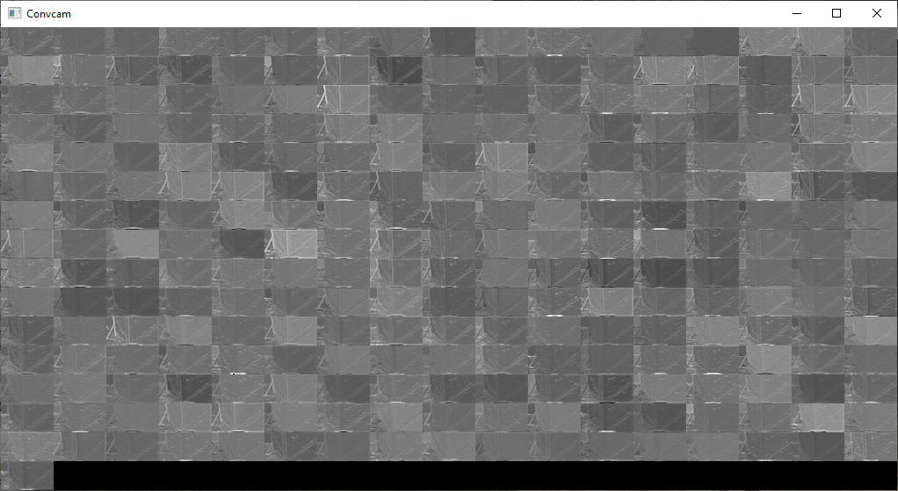
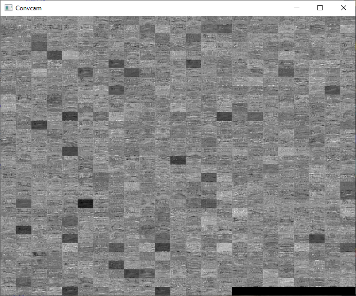
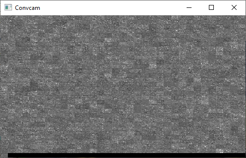
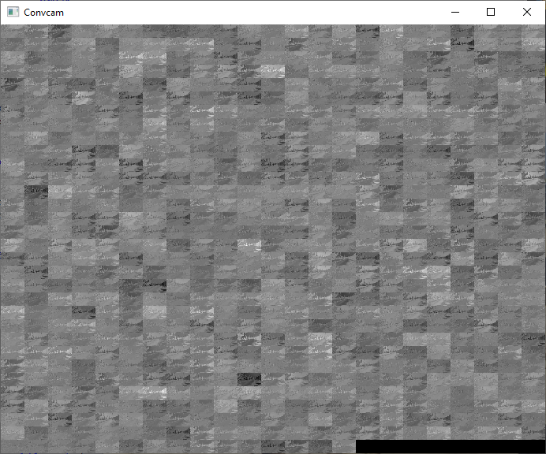
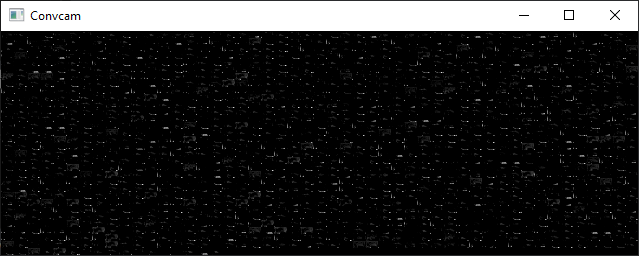
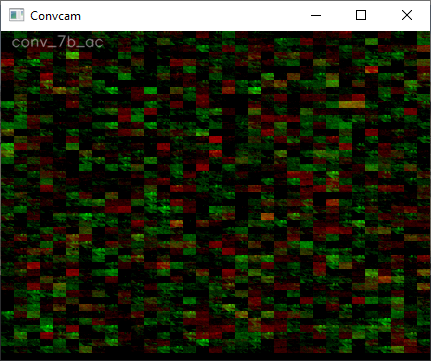
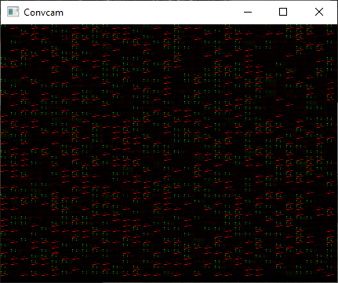

<< [Back](../../../)

# Convcam

## Table of Contents
- [`What is Convcam`](#what-is-convcam)
- [`Different convolution layers`](#different-convolution-layers)
- [`Blank model versus trained model`](#blank-model-versus-trained-model)
  - [[`Xception`](../project_info/xception.md)](#xception)
  - [[`InceptionResNetv2`](../project_info/inceptionresnetv2.md)](#InceptionResNetv2)
- [`Dual-CNN-backbone model`](#dual-cnn-backbone-model)

 
 

## What is Convcam

Convcam shows the reshaped output of a given convolutional layer. Currently, it's the last convolution layer, very deep into the model (previously - one of the early layers). What we mean by "reshaped" is that normally this layer outputs a small array (for example 11x7 points) for each kernel (of which there can be like 1536). We're forming a 2D image off of these small arrays by placing them next to each other. Convcam shows us if and how the model learns any features from the images. The bright points are (more or less with some simplification) activations while predicting.

 
 

## Different convolution layers

This is what the output of different convolutional layers of a CNN model looks like on an example of the (partially trained) [`Xception`](../project_info/xception.md) model. In this model, early convolutional layers output fewer but bigger "tiles", while the deeper in the model the "tiles" get smaller and the number of them raises. A "tile" is a single kernel output of a given layer and the output size depends both on the layer input shape and layer settings.

*Second convolution:*  

*Layer `add`:*  

*Layer `add_1`:*  

*Layer `add_10`:*  

*Layer `add_11`:*  

 
 

## Blank model versus trained model

### [`Xception`](../project_info/xception.md)

While the model trains, there can be seen changes in the convolutional layer outputs - they’re more visible the deeper we look into the model. In this example of the [`Xception`](../project_info/xception.md) model and `add_10` layer (which is pretty deep but not at the output of the CNN backbone) non-trained model shows mostly what we could call resized input image but using different shades of gray. While we train the model for some time, the "tiles" get "noiser" - kernels learn features and the outputs are becoming more what the model learned and less the original input (they are being trained to detect certain features on the images):

*Not trained (blank) model:*  

*Somewhat trained model:*  

### [`InceptionResNetv2`](../project_info/inceptionresnetv2.md)

The [`InceptionResNetv2`](../project_info/inceptionresnetv2.md) model is bigger and deeper than the [`Xception`](../project_info/xception.md) model. If we look at its layer `conv_7b_ac` which is also the last layer in the convolutional backbone, the images look a bit different - "tiles" are too small to see resized input, also the model is deeper and the outputs of the non-trained model are becoming more random (blank model is a random model). With training, they refine to something that outputs more like a single or a few pixels for each kernel only (the shape is different as these screenshots were taken at different points of time and the code for Convcam reshaping has changed):

*Not trained (blank) model:*  

*Somewhat trained model:*  

This layer is also the output of this CNN model backbone in our models and from some point, in time we're only using this CNN backbone output to see the training progress. Previously, we’ve been experimenting with the layers used.

 
 

## Dual-CNN-backbone model

Models [`model_0010_irv2_tcb`](../model_0010_irv2_tcb) and [`model_0011_x_tcb`](../model_0011_x_tcb) are using 2 separate CNN backbones for each of the outputs, so also the Convcam has had to be modified to reflect this and show both CNN parts' outputs, using 2 different colors. In this example, it's the latter model which is using [`Xception`](../project_info/xception.md) models as the CNN backbones:

*Not trained (blank) model:*  

*Somewhat trained model (a bit more than 1000 batches of training):*  

