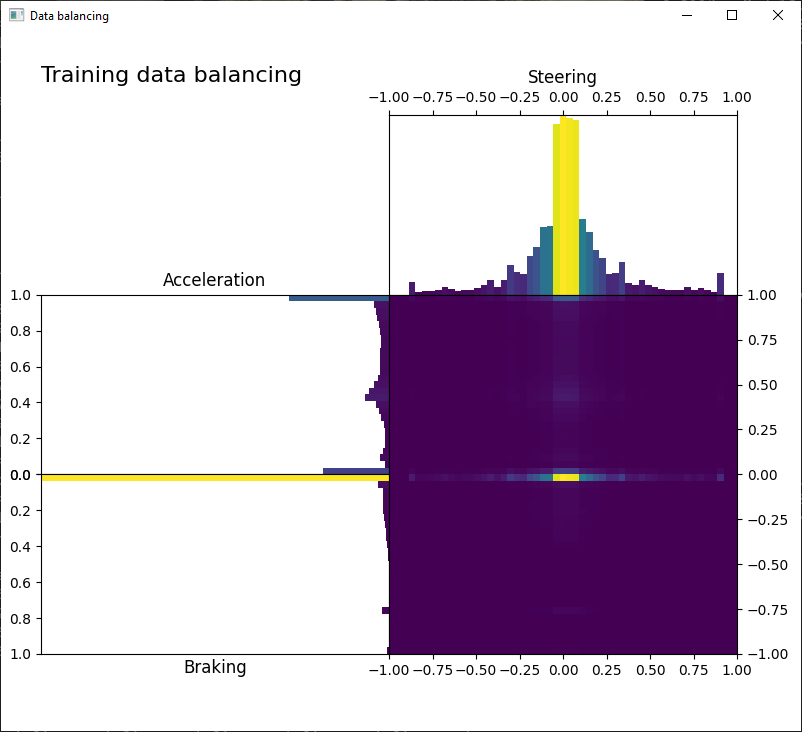
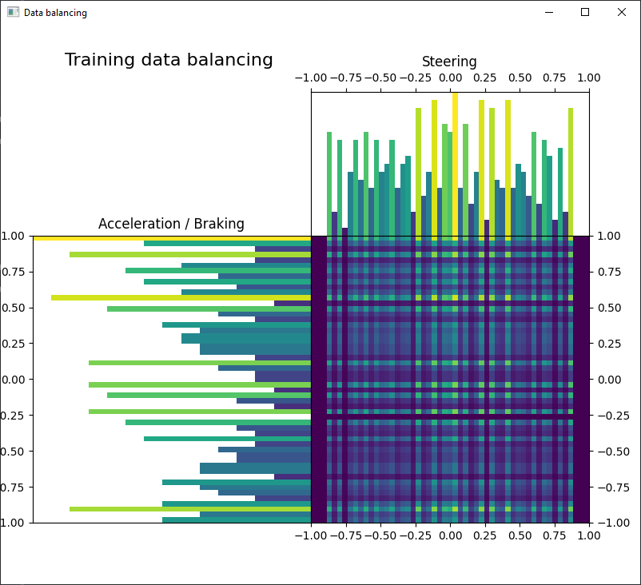
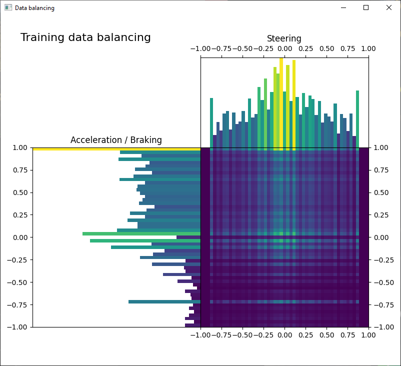

<< [Back](../../../)

# Data balancing

## Table of Contents
- [`Balancing_v1`](balancing_v1)
- [`Balancing_v2`](balancing_v2)
- [`Balancing_v3`](balancing_v3)
- [`Balancing_v4`](balancing_v4)

 
 

## `Balancing_v1`

Our early model training attempts did not use data balancing at all and this feature was added only right when we started training models and saving them along with their training logs. The [`model_0001_xception`](../model_0001_xception) model is using what we're calling [`Balancing_v1`](#balancingv1) - this was an attempt at data balancing by using binning and collecting samples for all possible output bin combinations.

Initially, we did not check how good our balancing is. For binning we chose values/ranges arbitrary (thinking they’re good): `[0.0, (0.0, 0.2), (0.2, 0.8), (0.8, 1.0), 1.0]` for acceleration and braking and `[-1.0, (-1.0, -0.6), (-0.6, -0.2), (-0.2, 0.0), 0.0, (0.0, 0.2), (0.2, 0.6), (0.6, 1.0), 1.0]` for steering. Values on these lists mean either a single value or a range assigned to a given bin number. Back then we had 3 outputs (acceleration and braking were not combined yet) and to balance a set we needed to collect a sample for each of the bin combinations, this meant a balanced sample set contained 225 samples (all combinations of 5 bins for the acceleration, 5 for braking and 9 for steering). This is for the regression outputs since our system lets us use discrete delta and classification outputs as well. This is also a simplified description as the binning, and the balancing is more complicated than this simple explanation. In the end, we are sending balanced sample sets to the [`Trainer`](../project_info/system.md) which builds `buffers` off of them and randomly draws batches from them for better data generalization.

All the trained model variations of the [`model_0001_xception`](../model_0001_xception) line did not work super well, they mostly have been turning just a little bit, and applied acceleration and braking also did not work as expected. At this point, we decided we should check our arbitrary chosen balancing and visualize how well it works. And we saw this:

We immediately knew what we thought is a decent balancing was indeed far from being even remotely good. The data contained in these “balanced” sets were composed of mostly data for no steering (driving straight), either full or no acceleration, and almost always no braking at all.

 
 

## `Balancing_v2`

At this point, we decided to create a better balancing. We changed bins to represent fixed-width ranges of the output values, respectively `[0.0, (0.0, 0.1), (0.1, 0.2), (0.2, 0.3), (0.3, 0.4), (0.4, 0.5), (0.5, 0.6), (0.6, 0.7), (0.7, 0.8), (0.8, 0.9), (0.9, 1.0), 1.0]` for acceleration and braking and `[(-1.0, -0.9), (-0.9, -0.8), (-0.8, -0.7), (-0.7, -0.6), (-0.6, -0.5), (-0.5, -0.4), (-0.4, -0.3), (-0.3, -0.2), (-0.2, -0.1), (-0.1, 0.0), 0.0, (0.0, 0.1), (0.1, 0.2), (0.2, 0.3), (0.3, 0.4), (0.4, 0.5), (0.5, 0.6), (0.6, 0.7), (0.7, 0.8), (0.8, 0.9), (0.9, 1.0)]` for steering. This, however, would yield a need to collect even more samples per balanced sample set than before (much more) which would take significantly more time slowing data collecting by a lot. This is when we decided to create a custom model - model in which we train each output separately. What this means is we no longer need to balance all bin combinations of all outputs, but instead balance only each of the outputs separately - this lets us collect balanced sample sets much quicker (12 combinations for acceleration and braking and 21 for steering). The sets contain only data related to the given output and, after sending them to the [`Trainer`](../project_info/system.md), they’re being put into separate `buffers` (one `buffer` per each output). During training, an equal number of samples is being drawn from each of the buffers and is being used to train each of the outputs (as well as the common model part). This balancing is being used with the [`model_0002_xception`](../model_0002_xception) model line which also contains a more complete explanation of the training process.

This balancing method yielded much better results:

But wasn't ideal

 
 

## `Balancing_v3`

Training each of the outputs separately meant the CNN backbone has been "seeing" different images for each of the outputs and the correlation between the outputs was absent. Also, a model needed to train on such data was slow to train. This is when we decided we need a better solution - a solution with which we can again use standard Keras models, and be able to train with full speed, but this required data for all outputs to be present in all of the samples again. We decided to take the approach of just adding these outputs back but keep balancing for each output separately. Since we are balancing for one output at a time still to avoid an enormous balanced sample set size, the remaining outputs are causing a slight un-balance to the data, but thanks to all of the outputs being again available in all of the samples we were again able to train all of the outputs at the same time and on the same input images. Model [`model_0003_xception`](../model_0003_xception) and all future models are using this balancing method:

The unbalance caused by this change is not ideal, but also not particularly bad. Some of the models are learning well anyway (and better than with the [`Balancing_v2`](#balancingv2))

 
 

## `Balancing_v4`

This balancing process can be further refined by adding the sub-balancing. While we're balancing certain outputs, we can write an algorithm to balance the other outputs as much as possible (instead of just taking the first sample - other samples might contain other values for other outputs making them useful to better balance the data). This is planned for the future and is not yet coded.
